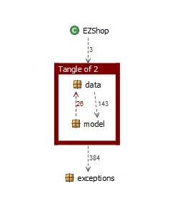

# Design assessment

# Levelized structure map

# Structural over complexity chart

# Size metrics

| Metric                                    | Measure |
| ----------------------------------------- | ------- |
| Packages                                  |    6    |
| Classes (outer)                           |    50    |
| Classes (all)                             |    56   |
| NI (number of bytecode instructions)      |    7197   |
| LOC (non comment non blank lines of code) |    3095  |

# Items with XS

| Item | Tangled | Fat  | Size | XS   |
| ---- | ------- | ---- | ---- | ---- |
|  ezshop.ezshop.it.polito.ezshop.model.EzShopModel	    |         |  201    |  3012    |   1213   |
|   ezshop.ezshop.it.polito.ezshop   |     5%    |   5   |   7,197   |  372   |

# Package level tangles

# Summary analysis

There are very few differences between the two deliveries, very little changes were required as most of the problems
could be isolated to a single bug in the bar code validation algorithm.  The main problems are a tangle between the
data and model package that can be resolved very easily with few refactoring steps, and the ezShopModel class being very fat,
this is more difficult to assess as this problem is embedded into the design and stems from having to couple the backend with
the frontend.  Having a class this big can be a weakness as it can be very difficult to navigate and debug the class. 
A possible fix could be dividing EzShopModel into multiple subclasses or delegating logical tasks more to the classes we already
have, for example now the correctness of the inputs is nearly always verified in EzShopModel,
this could be done in the subclasses.