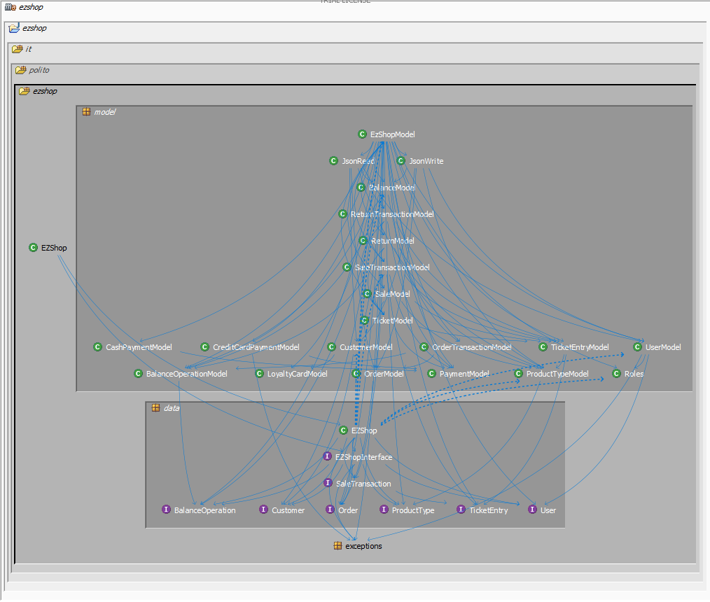
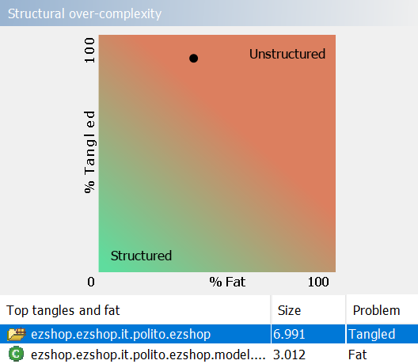

# Design assessment


```
<The goal of this document is to analyse the structure of your project, compare it with the design delivered
on April 30, discuss whether the design could be improved>
```

# Levelized structure map
```
<Applying Structure 101 to your project, version to be delivered on june 4, produce the Levelized structure map,
with all elements explosed, all dependencies, NO tangles; and report it here as a picture>
```



# Structural over complexity chart
```
<Applying Structure 101 to your project, version to be delivered on june 4, produce the structural over complexity chart; and report it here as a picture>

```




# Size metrics

```
<Report here the metrics about the size of your project, collected using Structure 101>
```


| Metric                                    | Measure |
| ----------------------------------------- | ------- |
| Packages                                  |    6    |
| Classes (outer)                           |    50    |
| Classes (all)                             |    56   |
| NI (number of bytecode instructions)      |    7197   |
| LOC (non comment non blank lines of code) |    3095  |


# Items with XS

```
<Report here information about code tangles and fat packages>
```

| Item | Tangled | Fat  | Size | XS   |
| ---- | ------- | ---- | ---- | ---- |
|  ezshop.ezshop.it.polito.ezshop.model.EzShopModel	    |         |  201    |  3012    |   1213   |
|   ezshop.ezshop.it.polito.ezshop   |     5%    |   5   |   7,197   |  372   |


# Package level tangles

```
<Report screen captures of the package-level tangles by opening the items in the "composition perspective" 
(double click on the tangle from the Views->Complexity page)>
```

# Summary analysis
```
<Discuss here main differences of the current structure of your project vs the design delivered on April 30>
<Discuss if the current structure shows weaknesses that should be fixed>
```
There are very few differences between the two deliveries, very little changes were required as most of the problems
could be isolated to a single bug in the bar code validation algorithm.</br> The main problems are a tangle between the
data and model package that can be resolved very easily with few refactoring steps, and the ezShopModel class being very fat,
this is more difficult to assess as this problem is embedded into the design and stems from having to couple the backend with
the frontend.</br> Having a class this big can be a weakness as it can be very difficult to navigate and debug the class.</br>
A possible fix could be dividing EzShopModel into multiple subclasses or delegating logical tasks more to the task we already
have, for example now the correctness of the inputs is nearly always verified in EzShopModel,
this could be done in the subclasses
