# Design Document 


Authors: 

Date:

Version:


# Contents

- [High level design](#package-diagram)
- [Low level design](#class-diagram)
- [Verification traceability matrix](#verification-traceability-matrix)
- [Verification sequence diagrams](#verification-sequence-diagrams)

# Instructions

The design must satisfy the Official Requirements document, notably functional and non functional requirements

# High level design 

<discuss architectural styles used, if any>
<report package diagram>
```plantuml

    package it.polito.ezshop.exceptions
    package it.polito.ezshop.model
    package it.polito.ezshop.data
    package it.polito.ezshop.GUI
    
    it.polito.ezshop.GUI -> it.polito.ezshop.data
    it.polito.ezshop.data -> it.polito.ezshop.exceptions
    it.polito.ezshop.data -> it.polito.ezshop.model
```


# Low level design

<for each package, report class diagram>


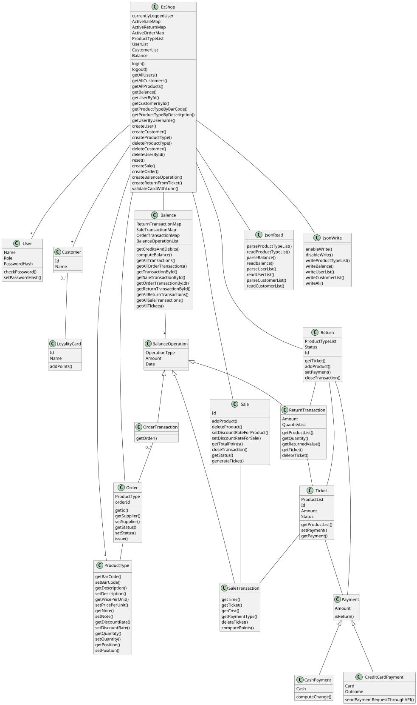


# Verification traceability matrix

\<for each functional requirement from the requirement document, list which classes concur to implement it>

|    FR ID         | EzShop | BalanceOperation | OrderTransaction | SaleTransaction | ReturnTransaction | Order | Sale | Return | Customer | LoyalityCard | User | ProductType | Ticket | Payment | CashPayment | CreditCardPayment | JsonWrite | JsonRead |   
| :----: | :----: | :----: | :----: | :----: | :----: | :----: | :----: | :----: | :----: | :----: | :----: | :----: | :----: | :----: | :----: | :----: | :----: | :----: |
| FR1 | X | | | | | | | | | X |||||||||
| FR3 |||||||||||||||||||
| FR4 |||||||||||||||||||
| FR5 |||||||||||||||||||
| FR6 |||||||||||||||||||
| FR7 |||||||||||||||||||
| FR8 |||||||||||||||||||


# Verification sequence diagrams 
\<select key scenarios from the requirement document. For each of them define a sequence diagram showing that the scenario can be implemented by the classes and methods in the design>

### SC1-1
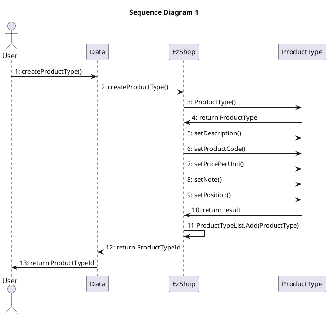

### SC1-3

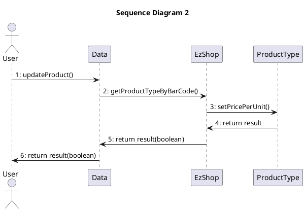

### SC2-1

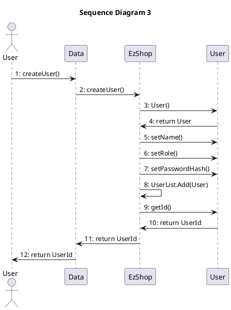

### SC2-2

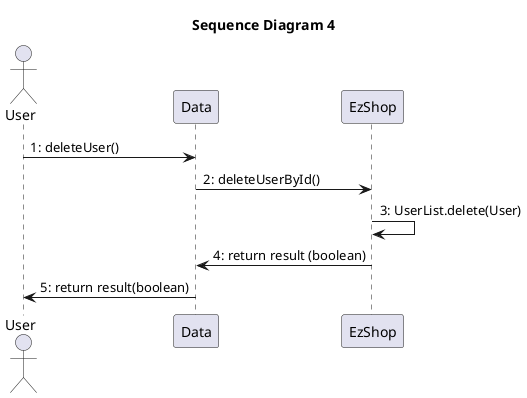

### SC3-1
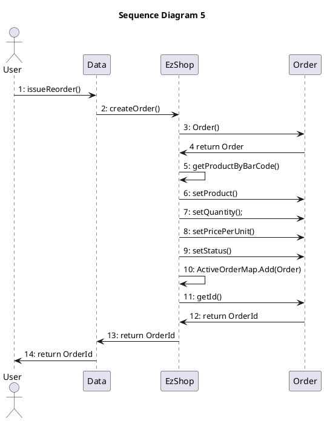

### SC3-2
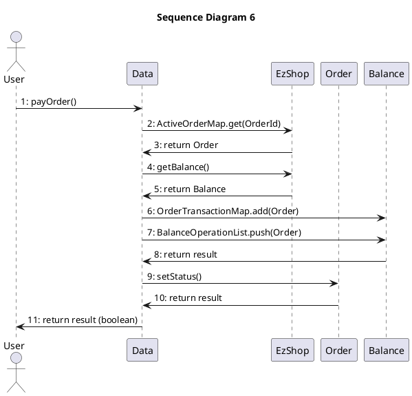

### SC3-3
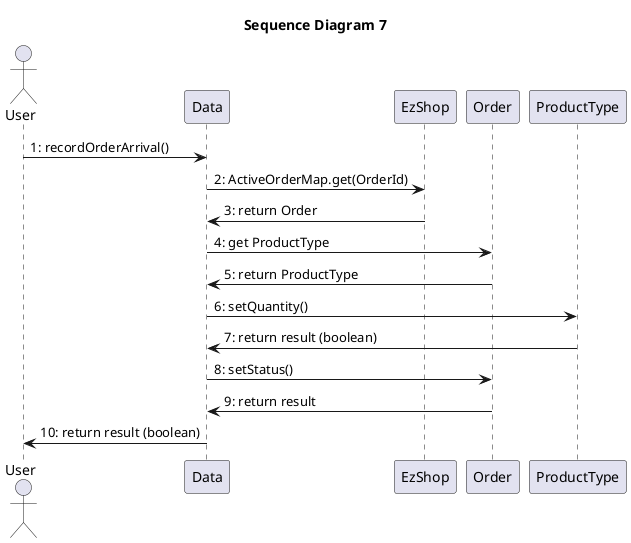

### SC4-1
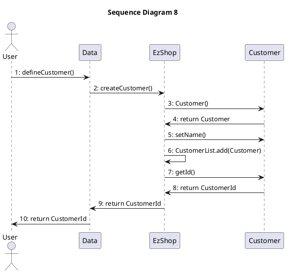

### SC5-1
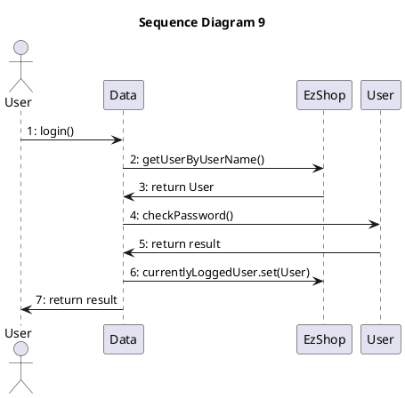

### SC6-1 and SC7-4

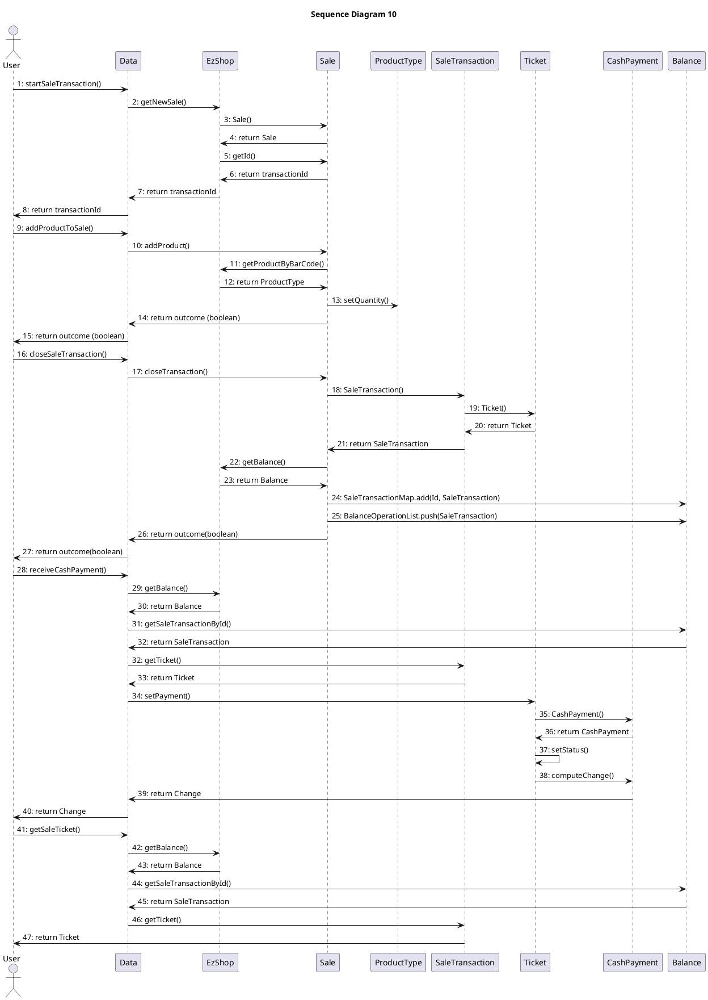

### SC6-4 and SC7-1


### SC8-2 and SC10-2


### SC9-1


