# Design Document 


Authors: Paolo Rabino, Manuel Messina, Andrea Sindoni, Omar Gai

Date: 30/05/2021

Version: 2.0


# Contents

- [High level design](#package-diagram)
- [Low level design](#class-diagram)
- [Verification traceability matrix](#verification-traceability-matrix)
- [Verification sequence diagrams](#verification-sequence-diagrams)

# Instructions

The design must satisfy the Official Requirements document, notably functional and non functional requirements

# High level design 

```plantuml

    package it.polito.ezshop.exceptions
    package it.polito.ezshop.model
    package it.polito.ezshop.data
    package it.polito.ezshop.GUI
    
    it.polito.ezshop.GUI -> it.polito.ezshop.data
    it.polito.ezshop.data -> it.polito.ezshop.exceptions
    it.polito.ezshop.data -> it.polito.ezshop.model
```

## Package GUI
Package for interacting with data facade, contains GUI interfaces and the event controller used for registering the users actions. The GUI creates
views from the data received by the Data Package
## Package Data
Package consisting in  a single class that contains all the APIs used by the GUI, interacts with the model package to fulfill the functional requirements.
## Package Model
Package that contains all the classes and methods used to model the principal components of the EzShop system, the package also contains classes
for implementing persistency of datas by saving the main classes in a json file after every operation that would cause a critical failure if 
lost during a power outage or accidental power off of the system. At every restart the json file can be parsed and read to restore the system to the
last saved state.
## Package Exceptions
Package that contains all possible exceptions thrown by the data and model package's classes.

# Low level design

```plantuml

@startuml

scale 0.7
class EzShopModel {
loadEZShop()
reset()
getUserById()
getUserList()
deleteUserById()
login()
logout()
createUser()
getBalance()
createOrder()
payOrderFor()
payOrder()
recordOrderArrival()
checkAuthorization()
recordBalanceUpdate()
getCreditsAndDebits()
computeBalance()
getOrderList()
createCustomer()
getCustomerById()
modifyCustomer()
deleteCustomer()
getAllCustomer()
createCard()
attachCardToCustomer()
modifyPointsOnCard()
createProduct()
getProductByBarCode()
getAllProducts()
getProductById()
updateProduct()
updateProductPosition()
deleteProduct()
receiveCashPayment()
receiveCreditCardPayment()
returnCashPayment()
returnCreditCardPayment()
startSaleTransaction()
addProductToSale()
deleteProductFromSale()
applyDiscountRateToProduct()
applyDiscountRateToSale()
computePointsForSale()
endSaleTransaction()
deleteSaleTransaction()
startReturnTransaction()
returnProduct()
endReturnTransaction()
deleteReturnTransaction()
checkId()
checkOrderInputs()
updateUserRights()
recordOrderArrivalRFID()
addProductToSaleRFID()
deleteProductFromSaleRFID()
returnProductRFID()

UserList
LoyaltyCardMap
CustomerMap
CurrentlyLoggedUser
ProductMap
ActiveOrderMap
activeSaleMap
activeReturnMap
balance
writer
reader
}

class UserModel{
    Id
    Password
    Username
    Role
  
    checkPassword()
    getEnumRole()
    getRoleFromString()
    getStringFromRole()
}
class CustomerModel{
    Id
    Name
    loyaltyCard

    getPoints()
    setPoints()
    getCustomerCard()
    setCustomerCard()
}
class LoyaltyCardModel{
    Id
    Points
    updatePoints()
    checkCard()
}
class ProductTypeModel{
    Quantity
    Location
    Note
    ProductDescription
    BarCode
    PricePerUnit
    ProductId 
    RFIDset

    updateAvailableQuantity()
    checkBarCodeWithAlgorithm()
    checkRFID()
    valid_rfid_range()
    add_rfids()
}
class OrderModel{
    ProductCode
    orderId
    status
    pricePerUnit
    Quantity
    TotalPrice
    date
    
    getDateS()
    computeTotalPrice()
}
class SaleTransactionModel{
    DiscountRate
    Ticket
    beforeMoney
    RFIDmap

    deleteTicket()
    computePoint()
    getTicketNumber()
    setTicketNumber()
    getEntries()
    getRealMoney()
    computeCost()
    updateAmount()
}
class SaleModel{
    balanceOperationId
    Id
    Status
    ProductList
    saleDiscountRate
    RFIDset

    addProduct()
    removeProduct()
    setDiscountRateForProduct()
    setDiscountRateForSale()
    generateTicket()
    computeCost()
    closeTransaction()
}
class TicketModel{
    TicketEntriesList
    Id
    Amount
    Status
    Payment
    setNewPayment()
}
class TicketEntryModel{
    barCode
    productDescription
    amount
    pricePerUnit
    discountRate
    addAmount()
    removeAmount()
    computeCost()

}

class PaymentModel{
    Amount
    isReturn
}
class CashPaymentModel{
    Cash
    computeChange()
}
class CreditCardPaymentModel{
    Outcome
    sendPaymentRequestThroughAPI()
    validateCardWithLuhn()
}

class ReturnTransactionModel{
    Status
    ReturnedProductList
    SaleId
    Payment
    AmountToReturn
  
}
class ReturnModel{
    Id
    Sale 
    SaleId
    Status
    ProductList
    RfidMap
    returneAmount
    commit()
}
class BalanceModel{
    OrderTransactionMap
    ReturnTransactionMap
    SaleTransactionMap
    creditAndDebitsOperationMap
    BalanceOperationList
    
    getSaleTransactionById()
    getReturnTransactionById()
    getOrderTransactionById()
    getTransactionById()
    addBalanceOperation()
    getCreditsAndDebits()
    getAllBalanceOperations()
    computeBalance()
    checkAvailability()
    addOrderTransaction()
    addSaleTransactionModel()
    addReturnTransactionModel()
}
class BalanceOperationModel{
    balanceId
    operationType
    money
    date

    getDateS()
    setDateS()
    isReturn()
}
class OrderTransactionModel{
    Order
}
class JsonRead{
    ProductFile
    BalanceFile
    UserFile
    CustomerFile
    OrderFile
    LoyaltyFile
    
    parseLoyalty()
    parseOrders()
    parseCustomers()
    parseUsers()
    parseProductType()
    parseBalance()
}
class JsonWrite{
    ProductWriter
    BalanceWriter
    UserWriter
    CustomerWriter
    OrderWriter
    LoyaltyWriter
    ProductTypeFile
    BalanceFile
    UserFile
    CustomerFile
    OrderFile
    LoyaltyFile
    reset()
    writeOrders()
    writeProducts()
    writeUsers()
    writeBalance()
    writeLoyaltyCards()
    writeCustomers()
}
BalanceOperationModel <|-- SaleTransactionModel
BalanceOperationModel <|-- ReturnTransactionModel
TicketModel -- SaleTransactionModel
ReturnTransactionModel -- TicketModel
ReturnModel -- ReturnTransactionModel
PaymentModel <|-- CreditCardPaymentModel
PaymentModel <|-- CashPaymentModel
TicketModel -- PaymentModel
BalanceModel  -- "*" BalanceOperationModel
BalanceOperationModel <|-- OrderTransactionModel
OrderTransactionModel"0..1" -- OrderModel
CustomerModel"0..1" -- LoyaltyCardModel
EzShopModel -- "*" UserModel
EzShopModel -- "*" CustomerModel
EzShopModel -- BalanceModel
EzShopModel -- "*" ProductTypeModel
EzShopModel -- "*" OrderModel
EzShopModel -- "*" LoyaltyCardModel
EzShopModel -- ReturnModel
EzShopModel --  "*" SaleModel
SaleModel -- SaleTransactionModel
EzShopModel -- JsonRead
EzShopModel -- JsonWrite
ReturnModel -- TicketModel
ReturnModel -- PaymentModel
OrderModel -- ProductTypeModel
SaleModel -- "*" ProductTypeModel
ReturnModel -- "*" ProductTypeModel
TicketModel -- "*" TicketEntryModel
ReturnModel -- "*" TicketEntryModel


@enduml
```


# Verification traceability matrix

| FR ID | EzShop | Balance | BalanceOperation | OrderTransaction | SaleTransaction | ReturnTransaction | Order | Sale | Return | Customer | LoyalityCard | User | ProductType | Ticket | Payment | CashPayment | CreditCardPayment | JsonWrite | JsonRead |
| :----: | :----: | :----: |:----: | :----: | :----: | :----: | :----: | :----: | :----: | :----: | :----: | :----: | :----: | :----: | :----: | :----: | :----: | :----: | :----: |
| FR1 | X | | |  |  |  |  |  |  |  |  |X||||||X||
| FR3 | X || | | | | | | | | | X |X|||||X||
| FR4 | X |X|X|X|||X|||||X|X|||||X||
| FR5 |X|||||||||X|X|X||||||X||
| FR6 |X|X|X||X|X||X|X|||X|X|X||||X||
| FR7 |X|X|X||X|X||X|X|||X||X|X|X|X|X||
| FR8 |X|X|X|||||||||X||||||X||


# Verification sequence diagrams 


### SC1-1
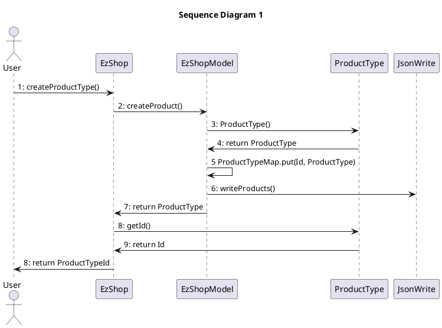

### SC1-3

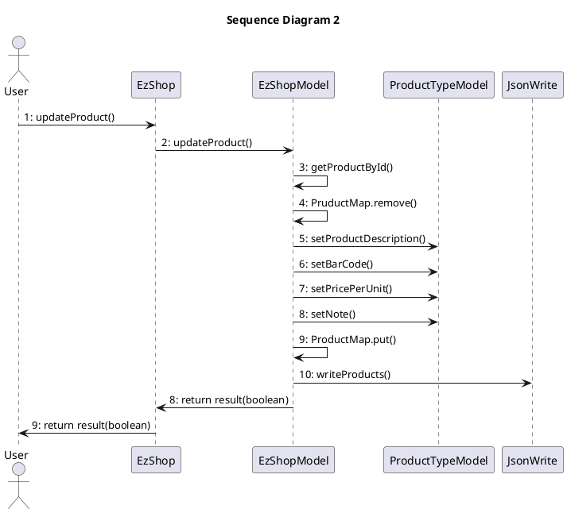

### SC2-1

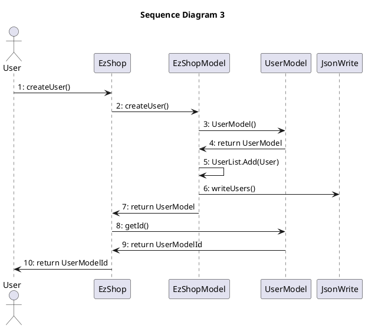

### SC2-2

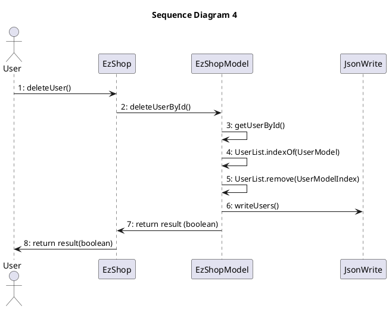

### SC3-1
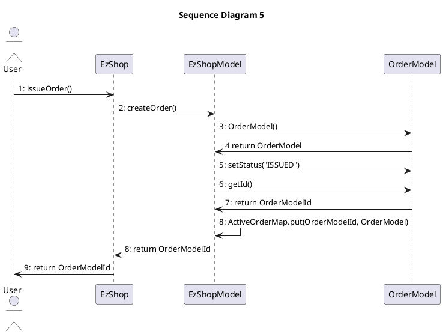

### SC3-2
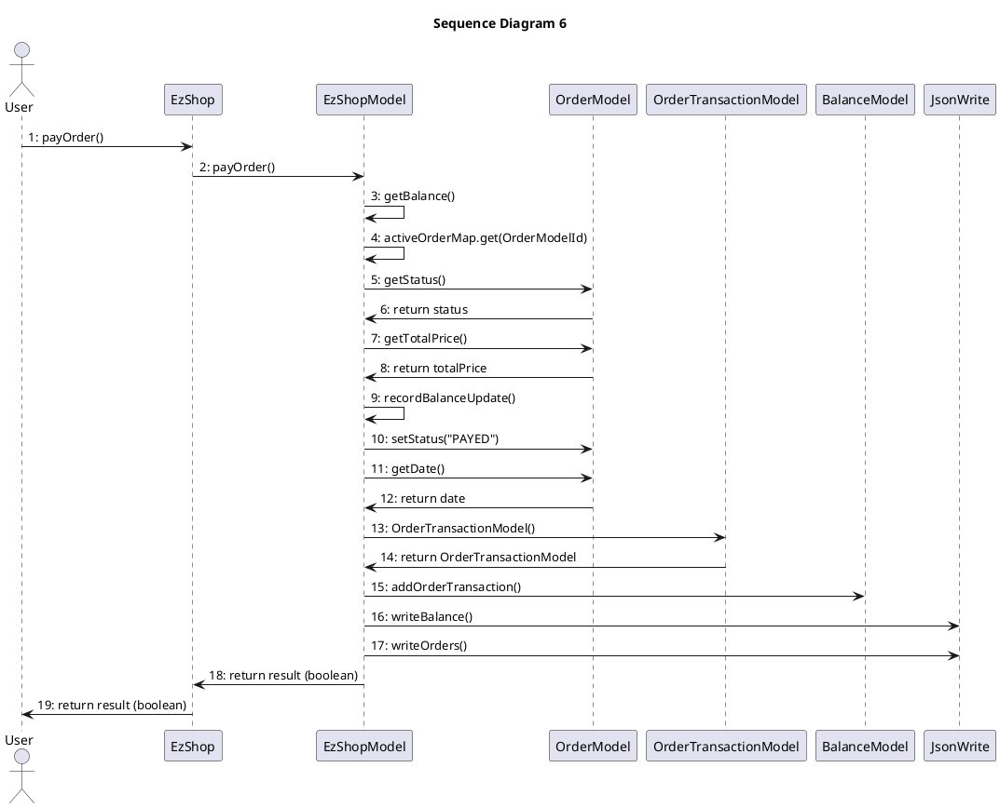

### SC3-3
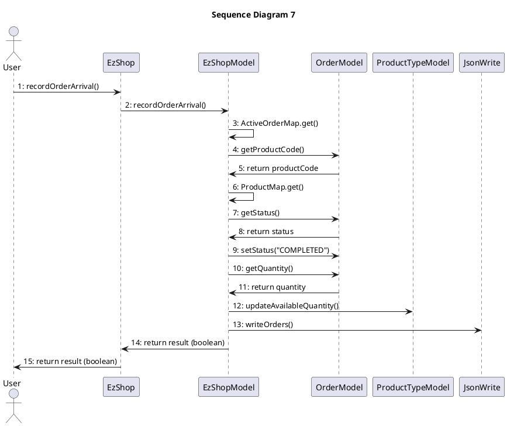

### SC4-1
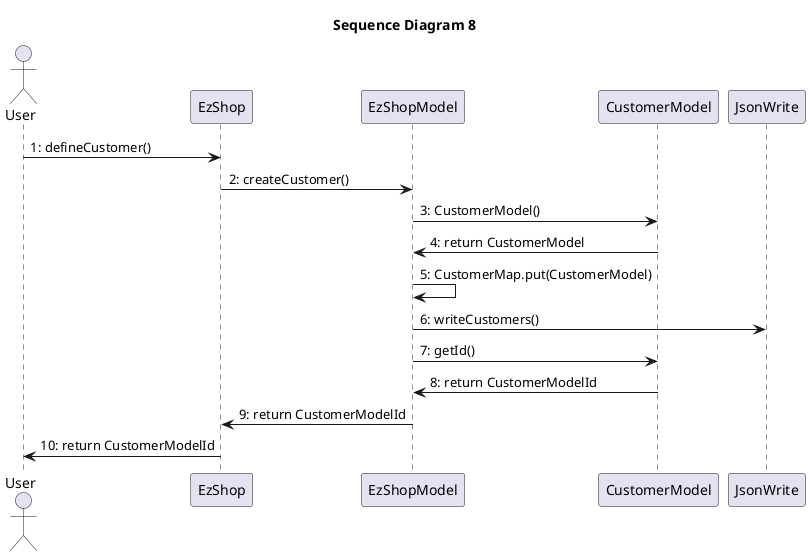

### SC5-1
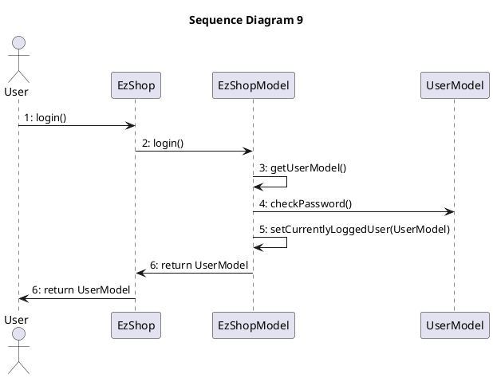

### SC6-1 and SC7-4

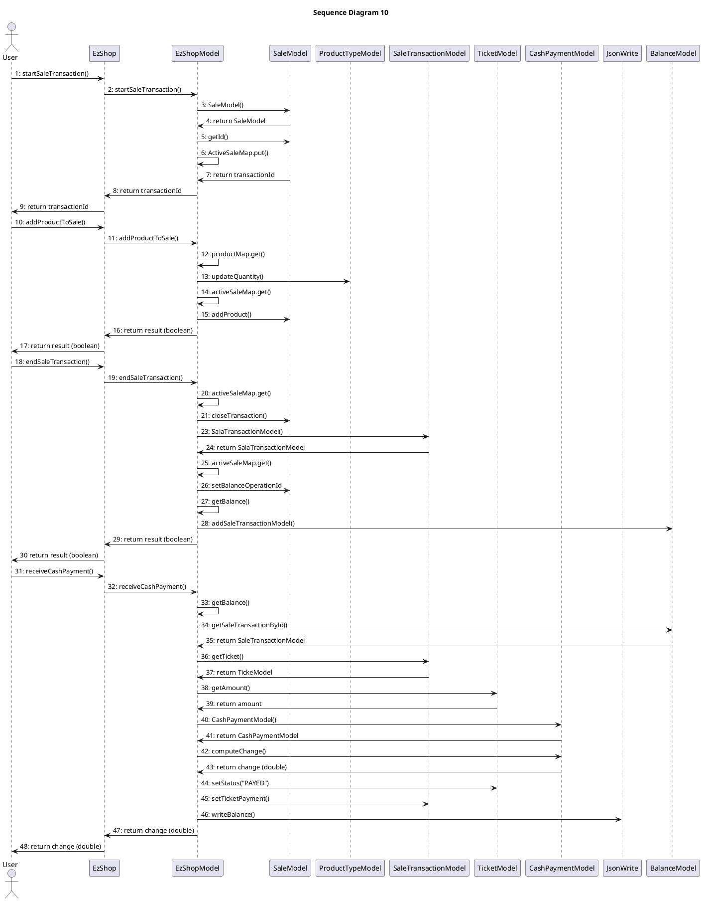

### SC6-4 and SC7-1
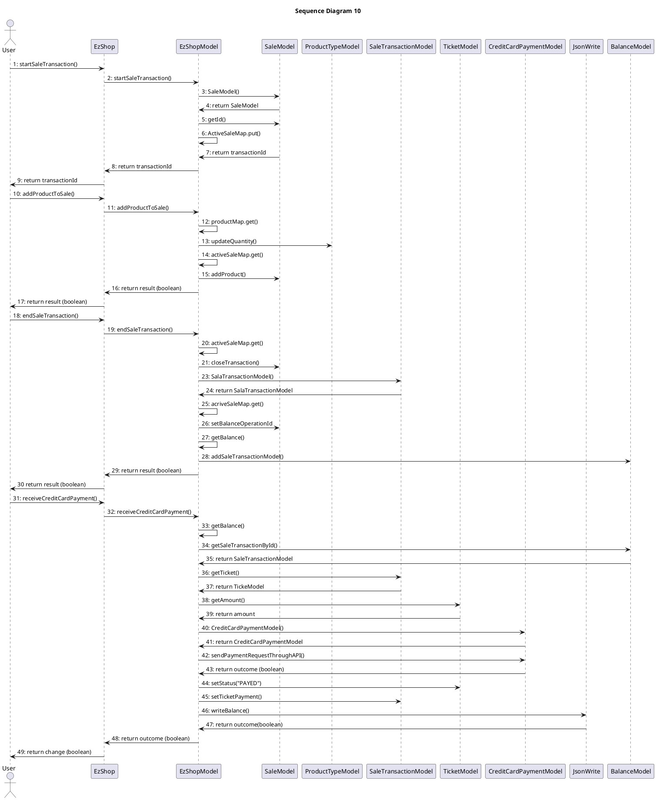

### SC8-2 and SC10-2

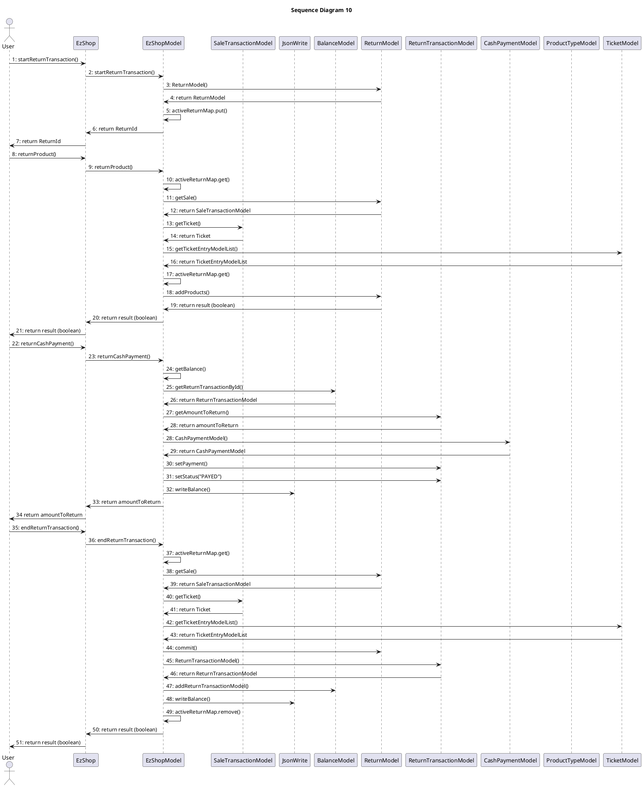
### SC9-1

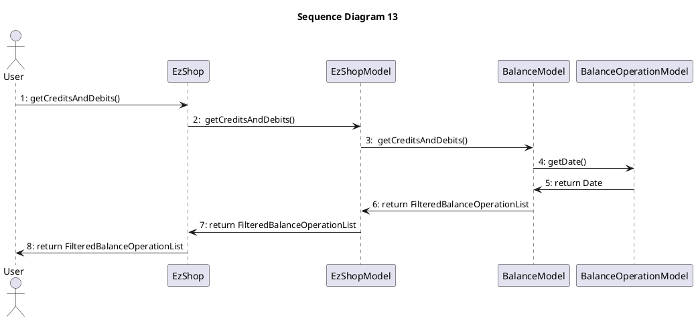
