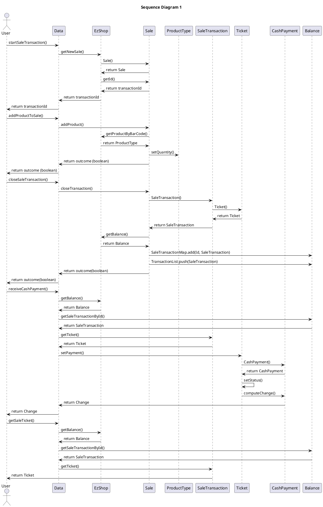

# Design Document 


Authors: 

Date:

Version:


# Contents

- [High level design](#package-diagram)
- [Low level design](#class-diagram)
- [Verification traceability matrix](#verification-traceability-matrix)
- [Verification sequence diagrams](#verification-sequence-diagrams)

# Instructions

The design must satisfy the Official Requirements document, notably functional and non functional requirements

# High level design 

<discuss architectural styles used, if any>
<report package diagram>
```plantuml
package frontend{

    package it.polito.ezshop.controller 
    package it.polito.ezshop.GUI
    }
package backend{
    package it.polito.ezshop.exceptions
    package it.polito.ezshop.model
    package it.polito.ezshop.data
    package it.polito.ezshop.back.controller
}


/'it.polito.ezshop.GUI --> it.polito.ezshop.model'/ 
/'it.polito.ezshop.controller --> it.polito.ezshop.model'/ 
it.polito.ezshop.exceptions --> it.polito.ezshop.data
it.polito.ezshop.model --> it.polito.ezshop.data
it.polito.ezshop.back.controller --> it.polito.ezshop.model
/'it.polito.ezshop.model --> it.polito.ezshop.data'/
```


# Low level design

<for each package, report class diagram>


```plantuml


class EzShop{
    login()
    logout()
    getAllUsers()
    getAllCustomers()
    getAllProducts()
    getBalance()
    getUserById()
    getCustomerById()
    getProductTypeByBarCode()
    getProductTypeByDescritption()
    createUser()
    createCustomer()
    createProductType()
    deleteProductType()
    deleteCustomer()
    deleteUserById()
    reset()
    getNewSale()
    getNewOrder()
    getNewTransaction()
    currentlyLoggedUser
}
class User{
    Name
    Role
    PasswordHash
    getId()
    getName()
    setName()
    getRole()
    setRole()
    checkPassword()
}
class Customer{
    getId()
    getName()
    setName()
    getLoyalityCard()
    setLoyalityCard()
}
class LoyalityCard{
    getId()
    getPoints()
    setPoints()
}
class ProductType{
    getBarCode()
    getDescription()
    setDescription()
    getProductCode()
    setProductCode()
    getPricePerUnit()
    setPricePerUnit()
    getNote()
    setNote()
    getDiscountRate()
    setDiscountRate()
    getQuantity()
    setQuantity()
    getPosition()
    setPosition()
}
class Order{
    getId()
    getSupplier()
    setSupplier()
    getProductList()
    setProductList()
    getQuantityList()
    setQuantityList()
    getStatus()
    setStatus()
    issue()
}
class Transaction{
    getId()
    getDesctiption()
    getAmount()
    getDate()
    
}
class SaleTransaction{
    getTime()
    getTicket()
    getCost()
    getPaymentType()
    deleteTicket()
    computePoints()
}
class Sale{
    getId()
    addProduct()
    deleteProduct()
    setDiscountRateForProduct()
    setDiscountRateForSale()
    getTotalPoints()
    closeTransaction()
    getStatus()
    generateTicket()
}
class Ticket{
    ProductList
    
    getId()
    getProductList()
    getAmount()
    setPayment()
    getPayment()
    getStatus()
    setStatus()
}
class Payment{
    Amount
    getAmount()
    setAmount()
    isReturn()
}
class CashPayment{
    Cash
    getCash()
    setCash()
    computeChange()
}
class CreditCardPayment{
    Card
    Outcome
    getCard()
    setCard()
    getOutcome()
    setOutcome()
}

class ReturnTransaction{
    Amount
    QuantityList
    getProductList()
    getQuantity()
    getReturnedValue()
    getTicket()
    deleteTicket()
}
class Return{
    ProductTypeList
    getTicket()
    addProduct()
    closeTransaction()
}
class Balance{
    TransactionList
    ReturnTransactionMap
    SaleTransactionMap
    OrderTransactionMap
    BalanceOperationMap
    getCreditsAndDebits()
    computeBalance()
    getAllTransactions()
    getAllOrderTransactions()
    getTransactionById()
    getSaleTransactionById()
    getOrderTransactionById()
    getReturnTransactionById()
    getAllReturnTransactions()
    getAllSaleTransactions()
    getAllTickets()
}
class BalanceOperation{
    OperationType
    Amount
    Date
    getOperationType()
    setOperationType()
    getAmount()
    getDate()
    setDate()
}
class OrderTransaction{
    getOrder()
}
class JsonRead{
    parseProductTypeList()
    readProductTypeList()
    parseBalance()
    readbalance()
    parseUserList()
    readUserList()
    parseCustomerList()
    readCustomerList()
}
class JsonWrite{
    enableWrite()
    disableWrite()
    writeProductTypeList()
    writeBalance()
    writeUserList()
    writeCustomerList()
    writeAll()
}
Transaction <|-- SaleTransaction
Transaction <|-- ReturnTransaction
Ticket -- SaleTransaction
ReturnTransaction -- Ticket
Return -- ReturnTransaction
Payment <|-- CreditCardPayment
Payment <|-- CashPayment
Ticket -- Payment
Balance  -- "*" BalanceOperation
Balance -- "*" Transaction
Transaction <|-- OrderTransaction
OrderTransaction"0..1" -- Order
Customer"0..1" -- LoyalityCard
EzShop -- "*" User
EzShop -- "*" Customer
EzShop -- Balance
EzShop -- "*" ProductType
EzShop -- Order
EzShop -- Return
EzShop --  Sale
Sale -- SaleTransaction
EzShop -- JsonRead
EzShop -- JsonWrite


```


# Verification traceability matrix

\<for each functional requirement from the requirement document, list which classes concur to implement it>


# Verification sequence diagrams 
\<select key scenarios from the requirement document. For each of them define a sequence diagram showing that the scenario can be implemented by the classes and methods in the design>

SC6-1 and SC7-4


