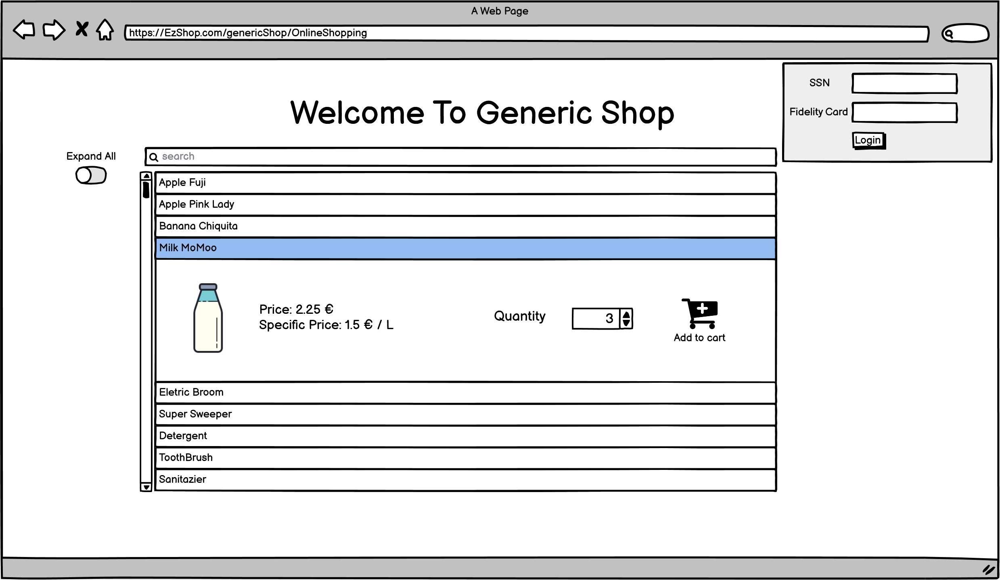
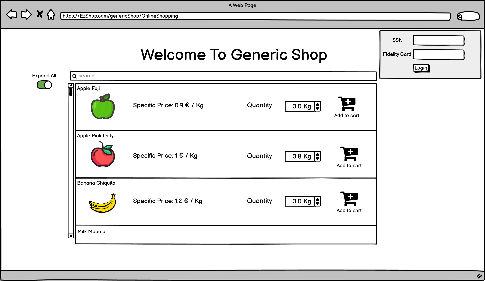
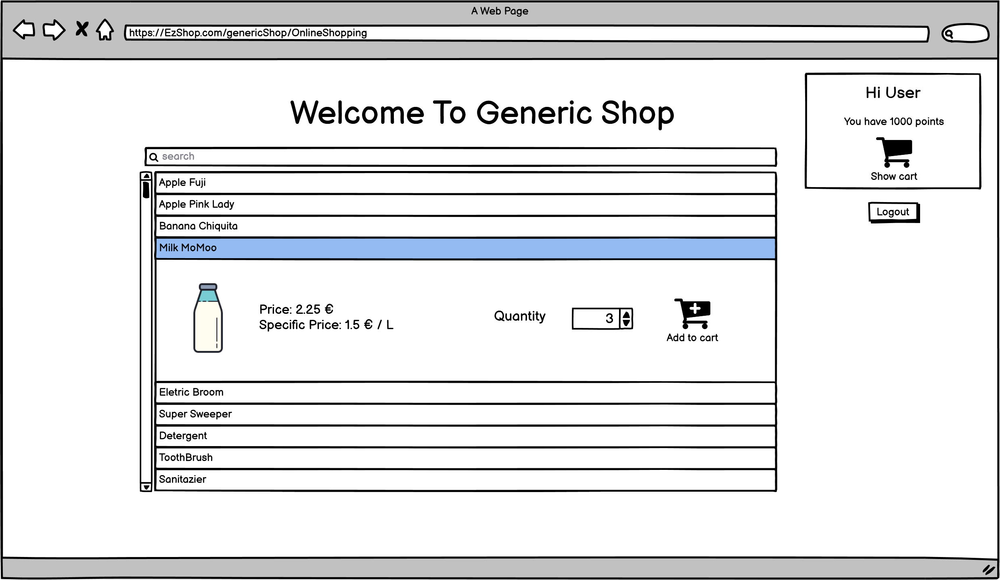
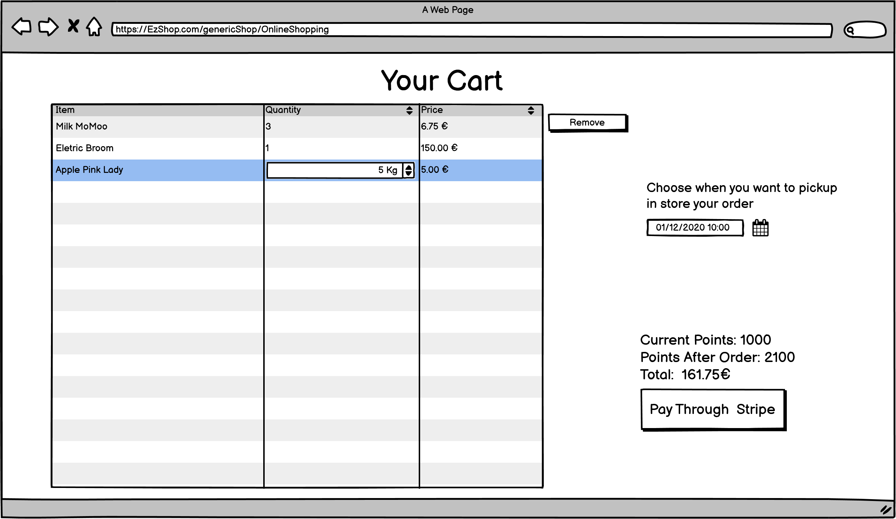

# Graphical User Interface Prototype  

Authors:

Date:

Version:

\<Report here the GUI that you propose. You are free to organize it as you prefer. A suggested presentation matches the Use cases and scenarios defined in the Requirement document. The GUI can be shown as a sequence of graphical files (jpg, png)  >
# General Employee Interface
## Employee and Owner Login

## Employee Interface Selection
Depending on the role of the Employee one or more buttons will be enabled

### Owner Interface
#### General View on Employees (UC6)

#### Define new Employee (UC4)

#### Modify Employee (UC5)

### Users Manager
#### General View on Customers (UC3)

#### Transfer Points Between Customers (UC7)

#### Create new Customer (UC1)

#### Modify Customer (UC2)

#### View Customer Purchase and Orders (UC27)

# Online Order Interface
#### General Online Page for catalogue

#### Shop cart view (UC26)

