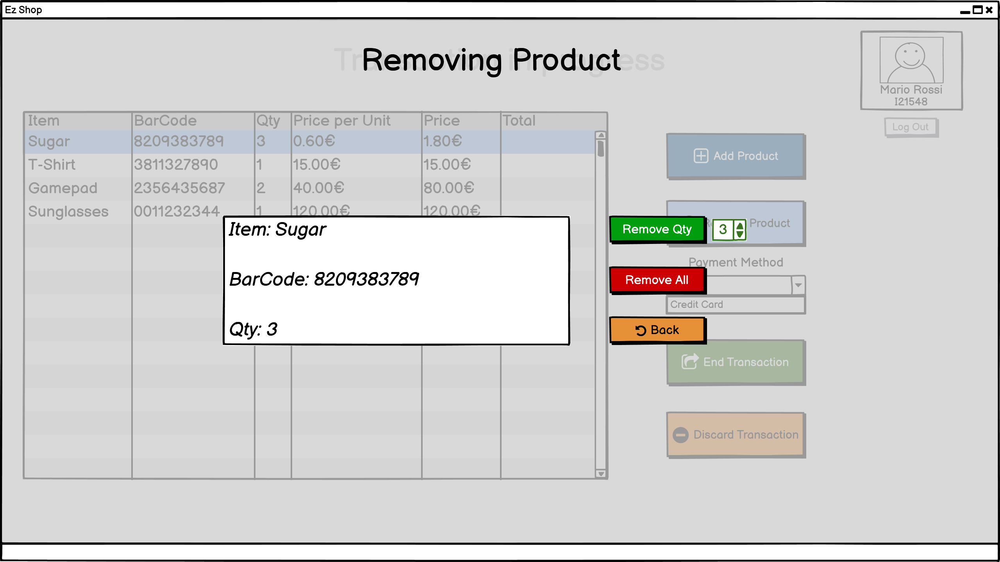
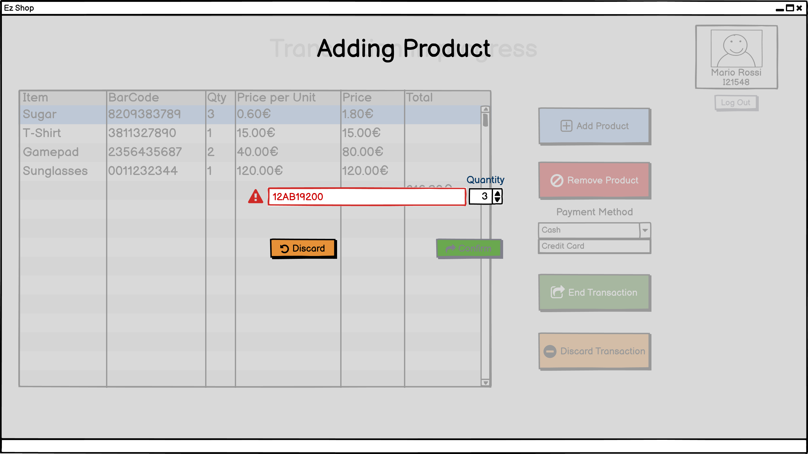
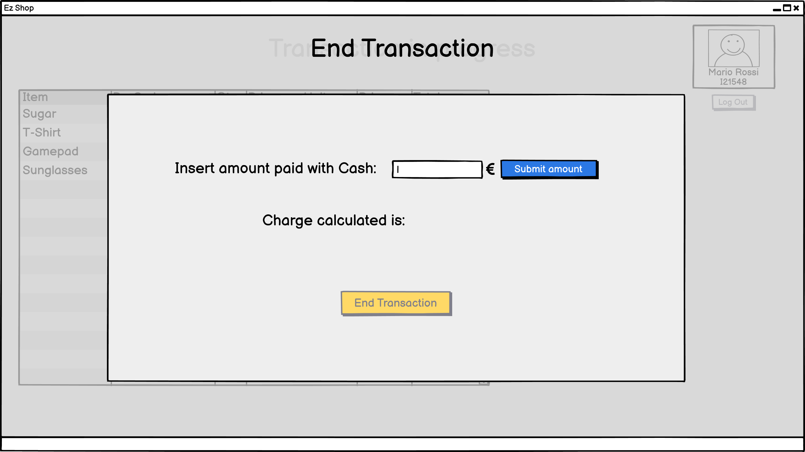
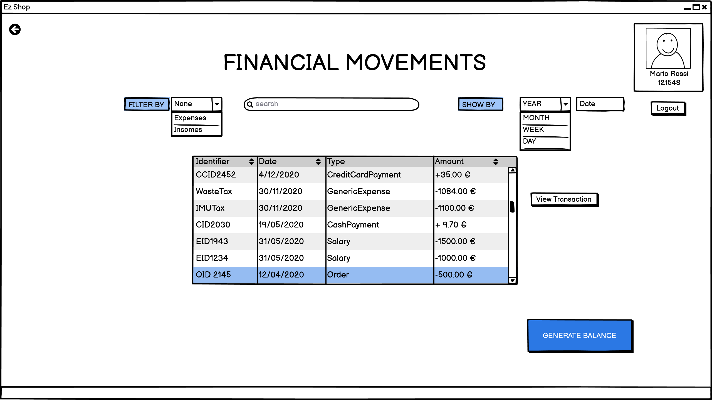
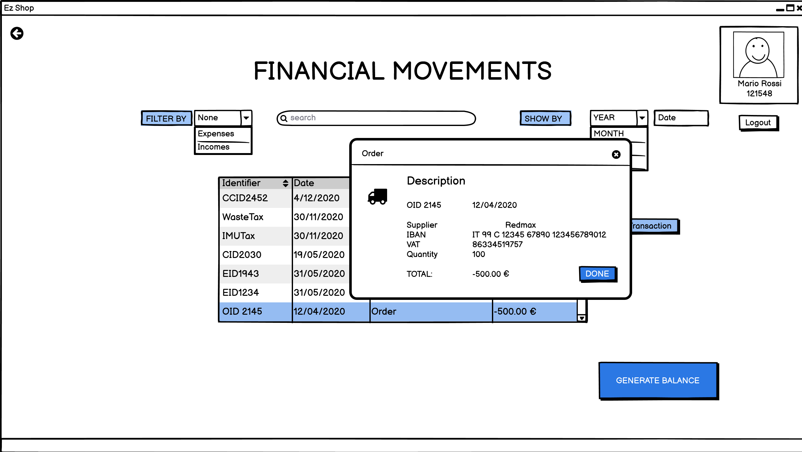
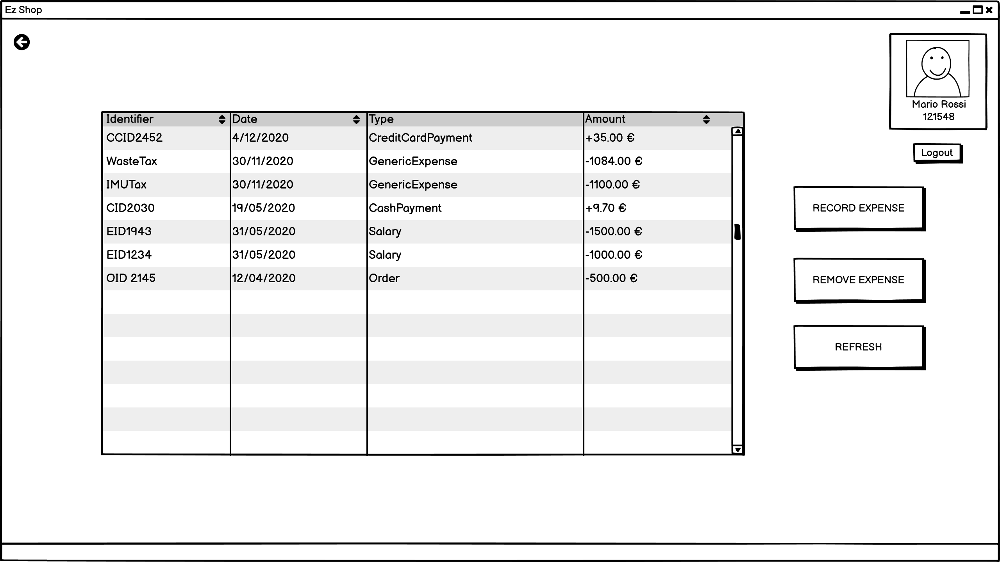
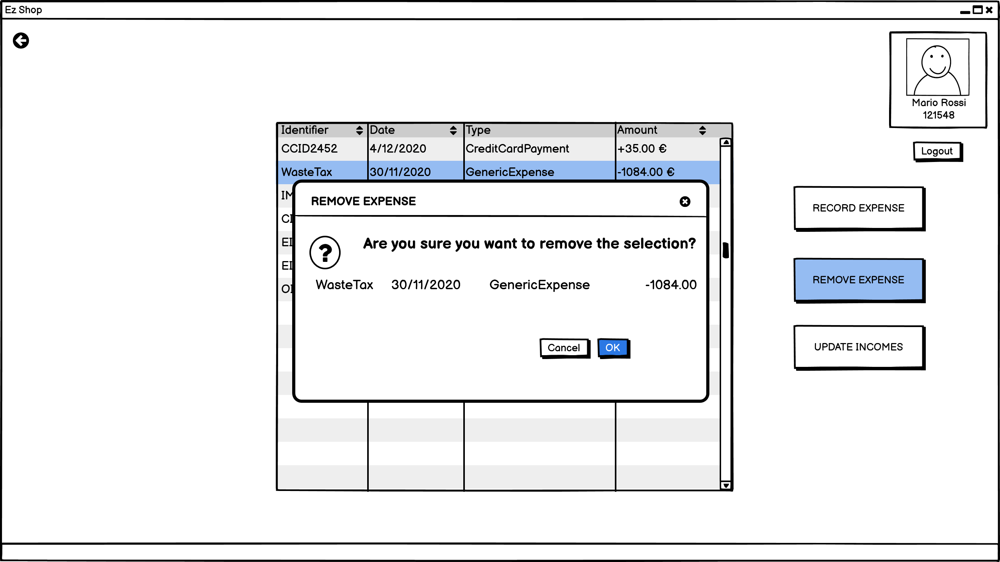
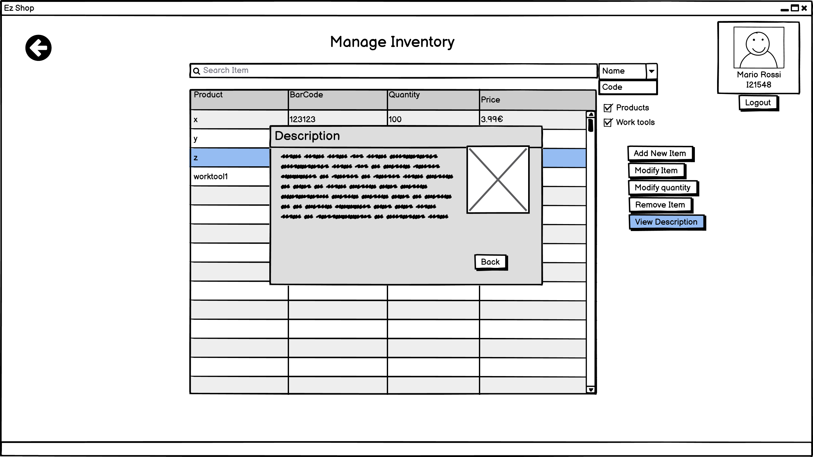
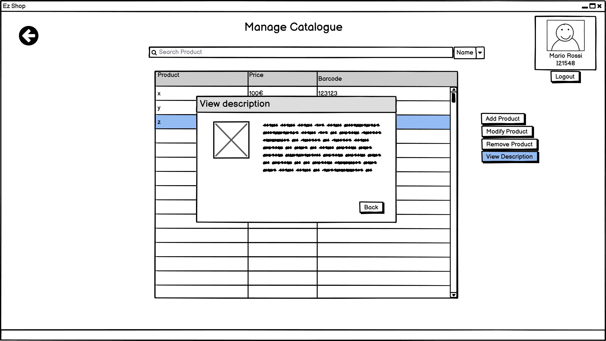

# Graphical User Interface Prototype  

Authors:Paolo Rabino, Andrea Sindoni, Omar Gai, Manuel Messina

Date:18/04/2021

Version:1.0

\<Report here the GUI that you propose. You are free to organize it as you prefer. A suggested presentation matches the Use cases and scenarios defined in the Requirement document. The GUI can be shown as a sequence of graphical files (jpg, png)  >
# General Employee Interface
## Employee and Owner Login

## Employee Interface Selection
Depending on the role of the Employee one or more buttons will be enabled

### Owner Interface
#### General View on Employees (FR8)

#### Define new Employee (FR8.1)

#### Modify Employee (FR8.1)

### Users Manager
#### General View on Customers

#### Transfer Points Between Customers (FR1.4.4)

#### Exchange Points for Product

#### Create new Customer (FR1.1)

#### Modify Customer (FR1.1)

#### View Customer Purchase and Orders 

# Online Order Interface
#### General Online Page for catalogue (FR7)

#### Show Customer orders

#### Shop cart view (FR7.4)

# Cashier Interface

### Main Page

### Transaction in progress
### Transaction main page (FR9)

### Removing product (FR9.1.2)

### Adding product (FR9.1.1)

### End Transaction with Credit Card (FR9.1.6)

### End Transaction with Cash (FR9.1.5)

### Discarding Transaction (FR9.1.7)

# Accountant Interface

### Main page (FR4)

### Description of each transaction (FR4.3 and FR4.4)

### Generate Balance (FR4.5)

### Manage expenses (FR4.2)

# Inventory Interface

### Manage Inventory (FR3)

#### Add Product/Worktool to Inventory (FR3.1)

#### Modify Item(FR3.1)

#### Modify quantity(FR3.3)

#### Remove Item(FR3.2)

#### View Description

### Manage Supply (FR5 and FR3.7)

#### Set Product's threshold (FR3.7.1)

#### Remove Product's threshold (FR3.7.2)

#### Add Supplier (FR5.1)

#### Modify Supplier (FR5.1)

#### View Supplier Description

#### Register Order (FR6.4)

#### View Orders

### Manage catalogue (FR3.8)

#### Add Product to Catalogue (FR3.8.1)

#### Modify Product (FR3.8.1)

#### Remove Product from Catalogue (FR3.8.2)

#### View Description

