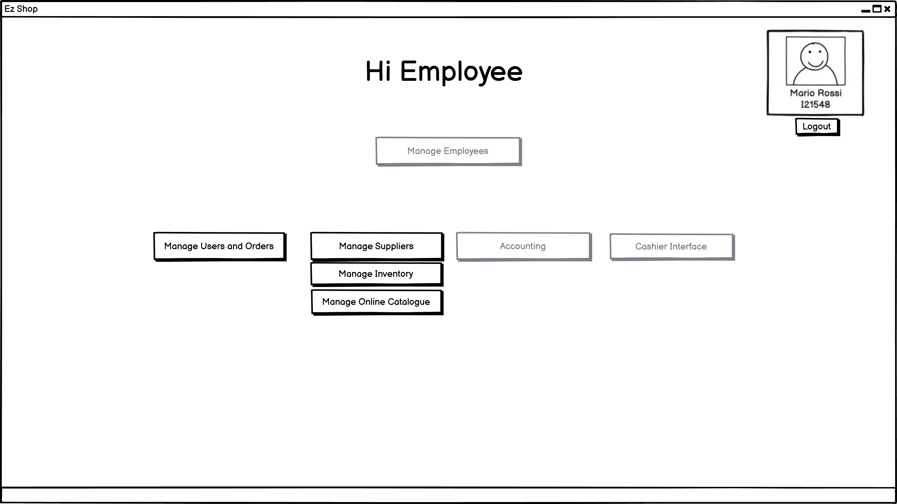
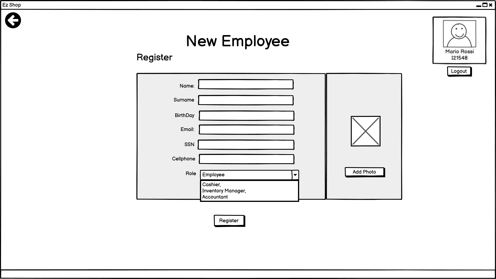
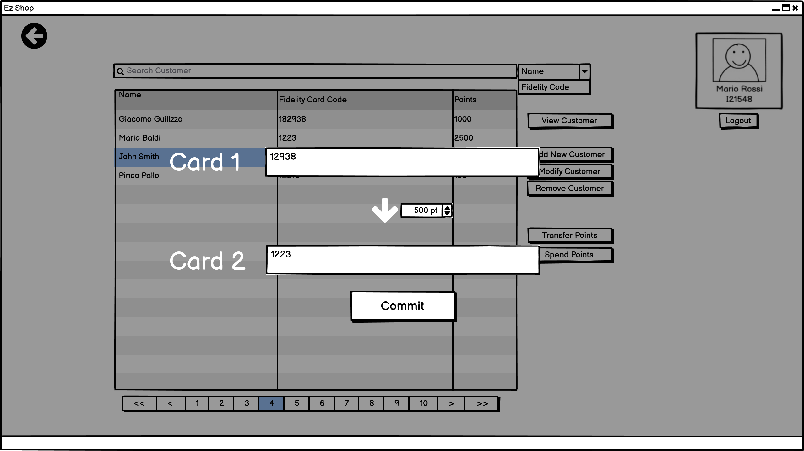
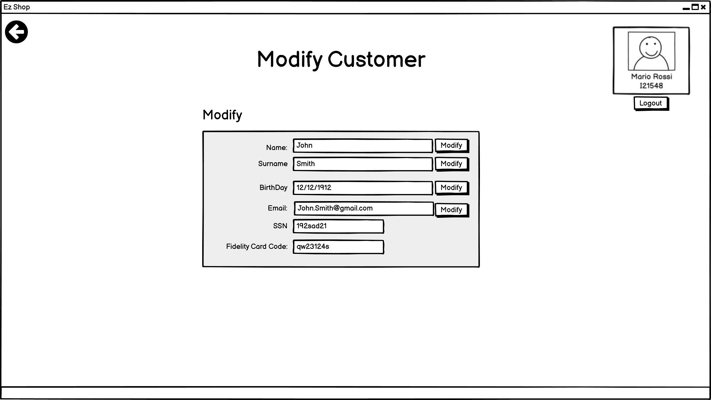
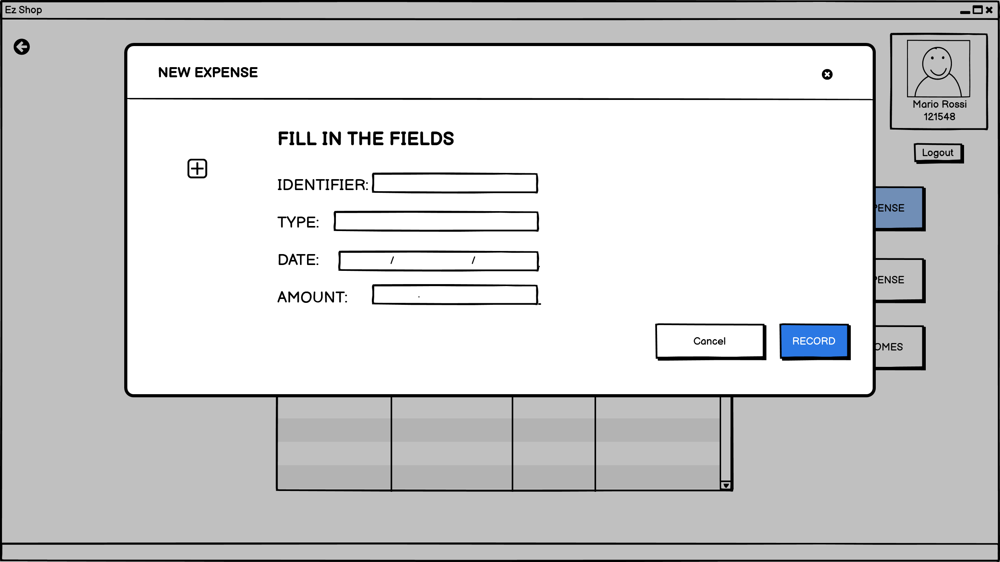
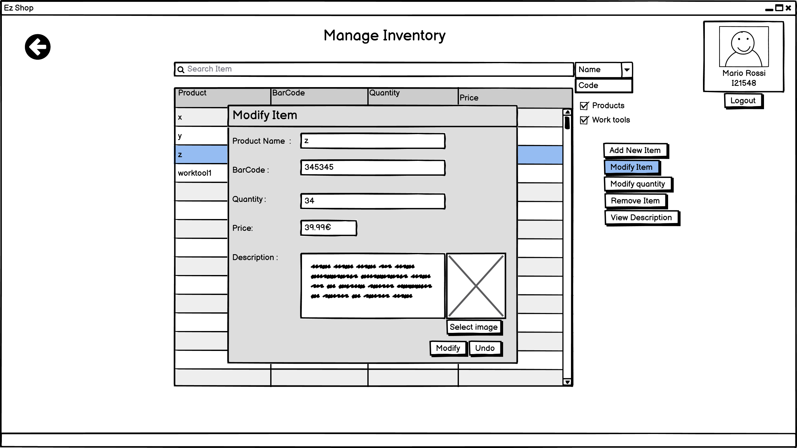
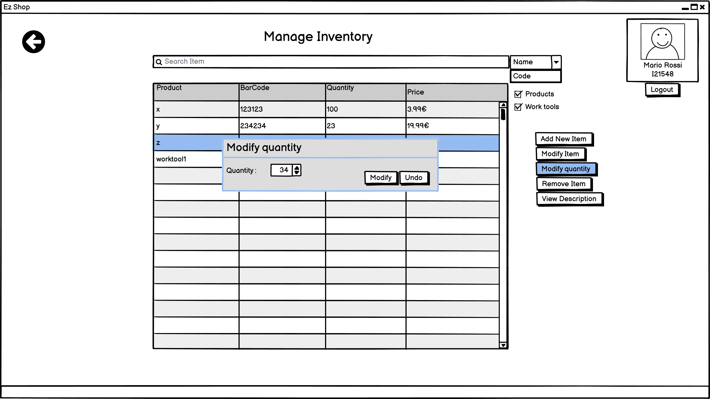
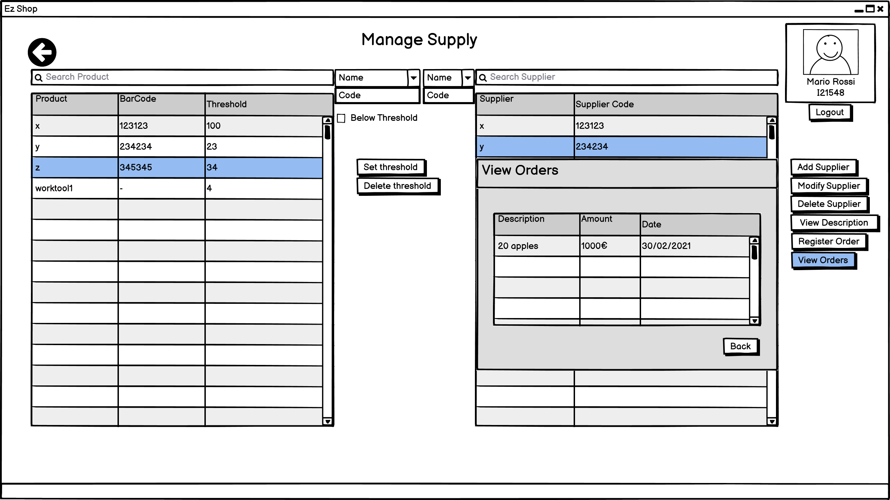
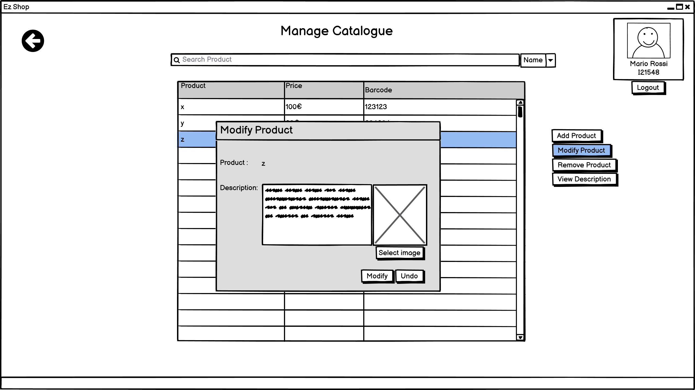

# Graphical User Interface Prototype  

Authors:Paolo Rabino, Andrea Sindoni, Omar Gai, Manuel Messina

Date:18/04/2021

Version:1.0

\<Report here the GUI that you propose. You are free to organize it as you prefer. A suggested presentation matches the Use cases and scenarios defined in the Requirement document. The GUI can be shown as a sequence of graphical files (jpg, png)  >
# General Employee Interface
## Employee and Owner Login

## Employee Interface Selection
Depending on the role of the Employee one or more buttons will be enabled

### Owner Interface
#### General View on Employees (UC6)

#### Define new Employee (UC4)

#### Modify Employee (UC5)

### Users Manager
#### General View on Customers (UC3)

#### Transfer Points Between Customers (UC7)

#### Create new Customer (UC1)

#### Modify Customer (UC2)

#### View Customer Purchase and Orders (UC27)

# Online Order Interface
#### General Online Page for catalogue

#### Shop cart view (UC26)

# Cashier Interface

### Main Page

### Transaction in progress
### Transaction main page

### Removing product

### Adding product

### End Transaction with Credit Card

### End Transaction with Credit Cash

### Discarding Transaction

# Accountant Interface

### Main page

### Generate Balance

### Manage expenses

# Inventory Interface

### Manage Inventory

#### Add Product/Worktool to Inventory

#### Modify Item

#### Modify quantity

#### Remove Item

#### View Description

### Manage Supply 

#### Set Product's threshold

#### Remove Product's threshold

#### Add Supplier

#### Modify Supplier

#### View Supplier Description

#### Request Supplies

#### View Orders

### Manage catalogue

#### Add Product to Catalogue

#### Modify Product

#### Remove Product from Catalogue

#### View Description

