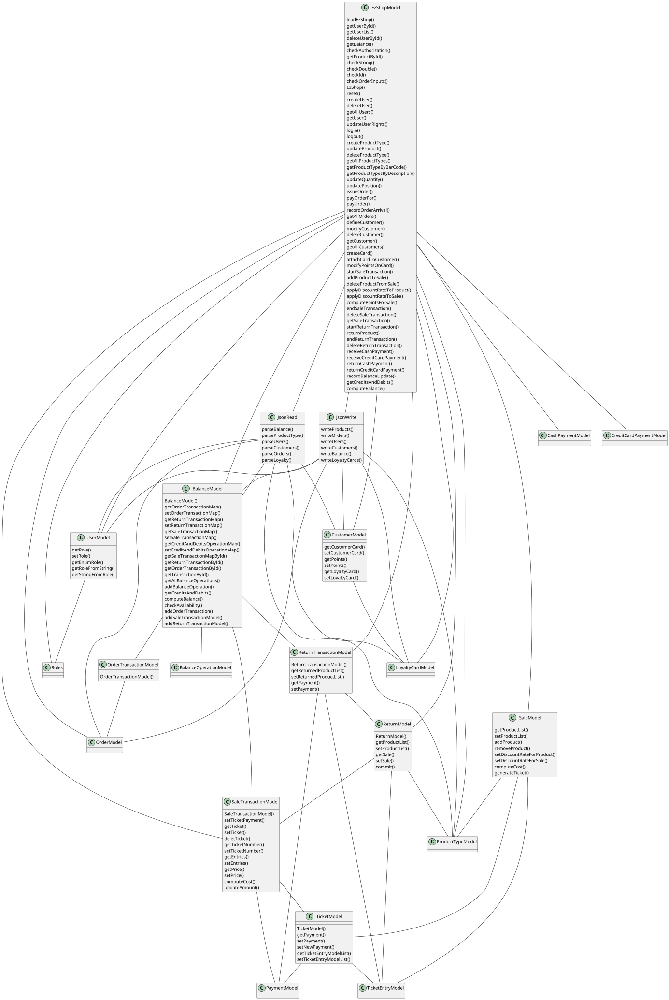

# Integration and API Test Documentation

Authors: Paolo Rabino, Andrea Sindoni, Manuel Messina , Omar Gai

Date: 25/05/2021

Version: 1.0

# Contents

- [Dependency graph](#dependency graph)

- [Integration approach](#integration)

- [Tests](#tests)

- [Scenarios](#scenarios)

- [Coverage of scenarios and FR](#scenario-coverage)
- [Coverage of non-functional requirements](#nfr-coverage)

# Dependency graph 

     
# Integration approach

    <Write here the integration sequence you adopted, in general terms (top down, bottom up, mixed) and as sequence
    (ex: step1: class A, step 2: class A+B, step 3: class A+B+C, etc)> 
    <Some steps may  correspond to unit testing (ex step1 in ex above), presented in other document UnitTestReport.md>
    <One step will  correspond to API testing>
    
Integration was done in a bottom up approach:
1. Unit Testing of leaf classes: 
2. Integration Testing of Balance Class and Persistence classes
3. API testing on the main facade class EzShopModel
4. Simulation of All Use Cases and Scenarios

#  Tests

## Step 1
| Classes  | JUnit test cases |
|----|----|
| UserModel | internalTest/UnitTest/UserModelTest |
| TicketModel | internalTest/UnitTest/TicketModelTest |
| SaleTransactionModel | internalTest/UnitTest/SaleTransactionModelTest |
| CreditCardPayment | internalTest/UnitTest/CreditCardPaymentTest |
| ProductTypeModel | internalTest/UnitTest/ProductTypeModelTest |
| OrderModel | internalTest/UnitTest/OrderModelTest |
| OrderTransactionModel | internalTest/UnitTest/OrderTransactionModelTest |
| LoyaltyCardModel | internalTest/UnitTest/LoyaltyCardModelTest |
| BalanceOperationModel | internalTest/UnitTest/BalanceOperationModelTest |
## Step 2
| Classes  | JUnit test cases |
|----|----|
|BalanceModel|internalTest/IntegrationTest/BalanceTest|
|JsonRead|internalTest/IntegrationTest/PersistenceTest|
|JsonWrite|internalTest/IntegrationTest/PersistenceTest|
|SaleModel|internalTest/IntegrationTest/SaleModelTest|
## Step 3

| Classes  | JUnit test cases |
|----|----|
|internalTest|APITest/FR1_UserTests|
|internalTest|APITest/FR3_ProductTypeTest|
|internalTest|APITest/FR4_OrderTests|
|internalTest|APITest/FR5_CustomerTests|
|internalTest|APITest/FR6_SaleTransactionTest|
|internalTest|APITest/FR7_PaymentTests|
|internalTest|APITest/FR8_BalanceTest|

## Step 4

| Classes  | JUnit test cases |
|----|----|
|internalTest|ScenarioTest|

# Coverage of Scenarios and FR

| Scenario ID | Functional Requirements covered | JUnit  Test(s) | 
| ----------- | ------------------------------- | ----------- | 
|  1-1         | FR3                             |      ScenarioTest/scenario1_1	|             
|  1-2         | FR3                             |       ScenarioTest/scenario1_2_3      |             
|  1-3         | FR3                                |      ScenarioTest/scenario1_2_3       |             
|  2-1         | FR1                               |        ScenarioTest/scenario2_1_3     |             
|  2-2         | FR1                                |       ScenarioTest/scenario2_1_3      |             
|  3-1         | FR4                                |      ScenarioTest/scenario3_1       |  
|  3-2         | FR4                             |      ScenarioTest/scenario3-2	|             
|  3-3         | FR4                             |       ScenarioTest/scenario3_3      |             
|  4-1         | FR5                                |      ScenarioTest/scenario4_1_4       |             
|  4-2         | FR5                                |        ScenarioTest/scenario4_2_3     |             
|  4-3         | FR5                                |       ScenarioTest/scenario4_2_3      |             
|  4-4         | FR5                               |      ScenarioTest/scenario4_1_4       | 
|  5-1         | FR1                             |      ScenarioTest/scenario5_1	|             
|  5-2         | FR1                             |       ScenarioTest/scenario5_2      |             
|  6-1         | FR6                                |      ScenarioTest/scenario6_1       |             
|  6-2         | FR6                                |        ScenarioTest/scenario6_2     |             
|  6-3         | FR6                                |       ScenarioTest/scenario6_3      |             
|  6-4         | FR6                                |      ScenarioTest/scenario6_4       | 
|  6-5         | FR6                             |      ScenarioTest/scenario6_5	|             
|  6-6         | FR6                             |       ScenarioTest/scenario6_6      |             
|  7-1         | FR7                                |      ScenarioTest/scenario7_1       |             
|  7-2         | FR7                                |        ScenarioTest/scenario7_2     |             
|  7-3         | FR7                                |       ScenarioTest/scenario7_3      |             
|  7-4         | FR7                                |      ScenarioTest/scenario7_4       | 
|  8-1         | FR6                                |      ScenarioTest/sc8_1sc10_1       |             
|  8-2         | FR6                                |        ScenarioTest/sc8_2sc10_2      |             
|  9-1         | FR8                               |       APITest/FR8/correctShowCreditsAndDebits      |             
|  10-1        | FR7                                |      ScenarioTest/sc8_1sc10_1       | 
|  10-2        | FR7                                |      ScenarioTest/sc8_2sc10_2       |

           

# Coverage of Non Functional Requirements

### 

| Non Functional Requirement | Test name |
| -------------------------- | --------- |
|               NFR4             |    UnitTest/ProductTypeTest/testCorrectBarcodeAlgorithm       |
|               -                |      UnitTest/ProductTypeTest/testWrongBarcodeAlgorithm |
|               NFR5             |     UnitTest/CreditCardPaymentTest/TestCorrectLuhn     |
|               -             |     UnitTest/CreditCardPaymentTest/TestWrongLuhn     |
|               NFR6             |    UnitTest/LoyaltyCardModelTest/checkCardTest      |

