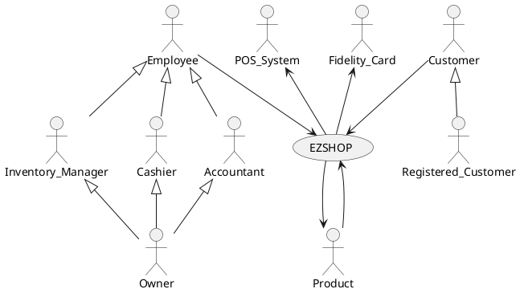

# Requirements Document 

Authors:

Date:

Version:

# Contents

- [Essential description](#essential-description)
- [Stakeholders](#stakeholders)
- [Context Diagram and interfaces](#context-diagram-and-interfaces)
	+ [Context Diagram](#context-diagram)
	+ [Interfaces](#interfaces) 
	
- [Stories and personas](#stories-and-personas)
- [Functional and non functional requirements](#functional-and-non-functional-requirements)
	+ [Functional Requirements](#functional-requirements)
	+ [Non functional requirements](#non-functional-requirements)
- [Use case diagram and use cases](#use-case-diagram-and-use-cases)
	+ [Use case diagram](#use-case-diagram)
	+ [Use cases](#use-cases)
    	+ [Relevant scenarios](#relevant-scenarios)
- [Glossary](#glossary)
- [System design](#system-design)
- [Deployment diagram](#deployment-diagram)

# Essential description

Small shops require a simple application to support the owner or manager. A small shop (ex a food shop) occupies 50-200 square meters, sells 500-2000 different item types, has one or a few cash registers 
EZShop is a software application to:
* manage sales
* manage inventory
* manage customers
* support accounting

# Stakeholders

| Stakeholder name  | Description | 
| ----------------- |:-----------:|
|	Customer  |	Use the application to find information about Products and Prizes, makes purchases  |
|	Registered Customer  |	Use the application to find information about Products and Prizes, can login making purchases online and accumulate and spend points  |
|	Shop's Owner  | Pays for the application and owns the shop to which the application is made for  |
|	Supplier  | Supplies some kind of Inventory Items to the Shop |
|	Stripe  | Provides the payment gateway for online shopping and the POS System for the shopping inside the physical shop |
|	Inventory Item  | It may be a product in sale, a product in the Prize Catalog (that is exchanged for points), or a Work Tool  |
|	Cashier |  Employee that handles transactions at the cash register, can register or delete customer accounts  |
|	Accountant  |  Employee that handles accounting |
|	Inventory Manager  |  Employee that manages inventory items from a logical point of view  |
|	Fidelity Card  |  Mechanism through which a Registered Customer is identified |

# Context Diagram and interfaces

## Context Diagram
\<Define here Context diagram using UML use case diagram>

\<actors are a subset of stakeholders>

## Interfaces
\<describe here each interface in the context diagram>

\<GUIs will be described graphically in a separate document>

| Actor | Logical Interface | Physical Interface  |
| ------------- |:-------------:| -----:|
|   Customer/Registered Customer    | Web Gui | Screen, keyboard, mouse, touchscreen |
|	Employee	| Gui | Screen Keyboard |
|	Product	| Bar Code | Bar Code Scanner |
|	Fidelity Card  | Card Code | Card Code Scanner |
|	POS System | Web Services | Internet Connection |
|	Cashier	 | Gui | Screen Keyboard |

# Stories and personas
\<A Persona is a realistic impersonation of an actor. Define here a few personas and describe in plain text how a persona interacts with the system>

\<Persona is-an-instance-of actor>

\<stories will be formalized later as scenarios in use cases>

Paul is 38 and just opened a new flower shop, he has some experience in business but not many resources to hire many workers. He spends many hours managing the inventory and the finances of his small shop. He thinks that he could better spend his time interacting with clients and taking care of the flowers.

Martina is 30 and works in an office all day. She wants to do shopping before going home, in his favorite food shop, once a week. She is very practical with computers and smartphones but doesn't want to dedicate too much time ordering online. 

Calogero is 29, he has been a cashier in a supermarket for the last 5 years. Being a cashier he has to deal with customers who want to receive a prize in exchange for their fidelity card points. In order to do so, every time a client asks for a certain item he should call an inventory worker to get the list of available items and eventually update it.

Giorgio is 23, he likes to play video games, for this reason often he goes to his favorite videogames shop and buys a lot of things. He would appreciate being rewarded for all his purchases.

# Functional and non functional requirements

## Functional Requirements

\<In the form DO SOMETHING, or VERB NOUN, describe high level capabilities of the system>

\<they match to high level use cases>

| ID        | Description  |
| ------------- |:-------------:| 
|  FR1    | Manage Registered Customer |
|  FR1.1  | Define a new customer or modify an existing one |
|  FR1.2  | Delete a Customer account  |
|  FR1.3  | List all Customers |
|  FR1.4  | Manage Fidelity Cards |
|  FR1.4.1  | Create Fidelity Card associated to the new Customer |
|  FR1.4.2  | Delete Fidelity Card |
|  FR1.4.3  | Update points on Card |
|  FR1.4.4  | Transfer points beetween Cards |
|  FR2  | Manage rights. Authorize access to functions to specific actors according to access rights |
|  FR3  | Manage Inventory |
|  FR3.1  | Define a new Inventory Item, or modify existing one |
|  FR3.2  | Remove Inventory Item |
|  FR3.3  | Update quantity of Inventory Items |
|  FR3.4  | List all Products |
|  FR3.5  | List all Prizes |
|  FR3.6  | List all Work tools |
|  FR3.7  | List all items with low quantity |
|  FR4 | Manage Accounting |
|  FR4.1 | Record each transaction |
|  FR4.2 | Record expenses for taxes and supplies |
|  FR4.3 | Show the total income per Day/Week/Month/Year |
|  FR4.4 | Show the total expenses per Week/Month/Year  |
|  FR5 | Manage Suppliers |
|  FR5.1 | Add new Supplier to Suppliers list |
|  FR5.2 | Delete Supplier from Suppliers list |
|  FR5.3 | List all Suppliers |
|  FR5.4 | List Suppliers of Products |
|  FR5.5 | List Suppliers of Work tools |
|  FR6   | Manage Replenishment |
|  FR6.1 | Add to Replenishment list Items which quantity is below a given threshold |
|  FR6.2 | Create an order notification at the end of the week based on Replenishment list and Suppliers list |
|  FR6.3 | Reset Replenishment list after order is done |
|  FR6.4 | Manage Order(?) |
|  FR6.4.1 | Add another product |
|  FR6.4.2 | Modify quantity |
|  FR6.4.3 | Modify  where product Supplier |
|  FR6.4.4 | Delete product |
|  FR6.4.5 | Validate order | 
|  FR7  | Manage Online Shopping |
|  FR7.1 | List all Products |
|  FR7.2 | Show Fidelity Card points |
|  FR7.3 | Show Fidelity Offers |
|  FR7.4 | Show History of transactions |
|  FR7.5 | Add Product to Cart |
|  FR7.6 | Remove Product from Cart |
|  FR7.7 | Show Products in Cart |
|  FR7.8 | Manage Order |
|  FR7.8.1 | Choose day of pickup in store |
|  FR7.8.2 | Create Order from cart |
|  FR7.8.3 | Modify Order |
|  FR7.8.4 | Pay for Order online |
|  FR7.8.5 | Delete an Order |
|  FR8   | Manage Employee Account |
|  FR8.1 | Define a new Employee or modify existing one |
|  FR8.2 | Delete Employee |
|  FR8.3 | List Employees |
|  FR8.4 | Search for an Employee |

## Non Functional Requirements

\<Describe constraints on functional requirements>

| ID        | Type (efficiency, reliability, ..)           | Description  | Refers to |
| ------------- |:-------------:| :-----:| -----:|
|  NFR1     |  Usability | Application should be used with no specific training for Cashiers and Customers | |
|  NFR2     | |  | |
|  NFR3     | | | |
| NFRx .. | | | | 

# Use case diagram and use cases

## Use case diagram
\<define here UML Use case diagram UCD summarizing all use cases, and their relationships>

\<next describe here each use case in the UCD>
### Use case 1, UC1 - Create Customer Account
| Actors Involved |  Customer, Employee    |
| ------------- |:-------------:| 
|  Precondition     | Customer Account A does not Exist |
|  Precondition		| Fidelity card code F not already associated to an Account   |
|  Post condition     | Account A added to the system  |
|  Post condition	  | Fidelity card F associated to A |	
|  Nominal Scenario     | A customer asks an employee to be enrolled in the fidelity program |
|  Variants     | Every customer can have at most 1 account and 1 fidelity card |

### Use case 2, UC2 - Modify user Account 
| Actors Involved        | Employee |
| ------------- |:-------------:| 
|  Precondition     | Account A exists |  
|  Post condition     | - |
|  Nominal Scenario     | Employee modifies account |
 
### Use case 3, UC3 - Delete User Account
| Actors Involved        | Employee |
| ------------- |:-------------:| 
|  Precondition     | Account A exists |  
|  Post condition     | Fidelity_Card F unbound from A |
|  Post condition     | Account A removed from the system |
|  Nominal Scenario     | Employee deletes account |

### Use case 3, UC3 - Delete User Account
| Actors Involved        | Employee |
| ------------- |:-------------:| 
|  Precondition     | Account A exists |  
|  Post condition     | Fidelity_Card F unbound from A |
|  Post condition     | Account A removed from the system |
|  Nominal Scenario     | Employee deletes account |

### Use case 4, UC4 - Create Employee Account
| Actors Involved        | Owner |
| ------------- |:-------------:| 
|  Precondition     | Account E does not exists |  
|  Post condition     | Account E added to the system |
|  Nominal Scenario     | Owner hires new employee |

### Use case 5, UC5 - Modify Employee Account
| Actors Involved        | Owner |
| ------------- |:-------------:| 
|  Precondition     | Account E exists |  
|  Post condition     | - |
|  Nominal Scenario     | Owner modifies employee account |

### Use case 6, UC6 - Delete Employee Account
| Actors Involved        | Owner |
| ------------- |:-------------:| 
|  Precondition     | Account E exists |  
|  Post condition     | Account E removed from the system |
|  Nominal Scenario     | Owner hires new employee |

### Use case 7, UC7 - Transfer points beteen user accounts
| Actors Involved        | Employee |
| ------------- |:-------------:| 
|  Precondition     | Account A1 exists |
|  Precondition		| Account A2 exists |  
|  Post condition     | A1 has no points |
|  Post condition     | A2 has preceding points + A1 preceding points |
|  Nominal Scenario     | Employee transfer points beetween user accounts |

### Use case 8, UC8 - Record Generic Expense
| Actors Involved        | Accountant |
| ------------- |:-------------:| 
|  Precondition     |  |  
|  Post condition     | Expense EX registered in the system |
|  Post condition	  | Balance is updated |
|  Nominal Scenario     | The accountant registers a generic expense |

### Use case 9, UC9 - Delete Generic Expense
| Actors Involved        | Accountant |
| ------------- |:-------------:| 
|  Precondition     | Expense EX exists |  
|  Post condition     | Expense EX removed from the system |
|  Nominal Scenario     | An Accountant removes an expense from the system |

### Use case 10, UC10 - Generate Balance
| Actors Involved        | Accountant |
| ------------- |:-------------:| 
|  Precondition     | At least one financial movement is recorded |  
|  Post condition     | Balance Exists |
|  Post condition	  | Balance can be exported with proper file extension |
|  Nominal Scenario     | Accountat A generates balance |

### Use case 11, UC11 - Show Financial movements
| Actors Involved        | Accountant |
| ------------- |:-------------:| 
|  Precondition     | Time range is valid |  
|  Post condition     |  |
|  Nominal Scenario     | Accountat selects a time range and the system shows all financial movements relative to that range |
|  Variants   | Filter only by expenses |
|  Variants   | Filter only by income |

### Use case 12, UC12 - Define new Inventory item
| Actors Involved        | Item, Inventory_Manager |
| ------------- |:-------------:| 
|  Precondition     | Item X doesn't exist |  
|  Post condition     | Item X added to inventory |
|  Nominal Scenario     | Inventory manager creates a new item and describes it |
| | Inventory manager specifies quantity|
|  Variants   | If the item is a Product, bar code and price are also registered |

### Use case 13, UC13 - Modify Inventory item
| Actors Involved        |  Inventory_Manager |
| ------------- |:-------------:| 
|  Precondition     | Item X exists |  
|  Post condition     ||
|  Nominal Scenario     | Inventory manager modifies one or more fields of item X |

### Use case 14, UC14 - Remove Inventory item
| Actors Involved        |  Inventory_Manager |
| ------------- |:-------------:| 
|  Precondition     | Item X exists |  
|  Post condition     | Item X is removed from the system |
|  Nominal Scenario     | Inventory manager removes X from the system |

### Use case 15, UC15 - Update Quantity
| Actors Involved        |  Inventory_Manager |
| ------------- |:-------------:| 
|  Precondition     | Item X exists |  
|  Post condition     | - |
|  Nominal Scenario     | Inventory manager mofifies quantity of x |

### Use case 16, UC16 - Register Supplier 
| Actors Involved        |  Inventory_Manager |
| ------------- |:-------------:| 
|  Precondition     | - |  
|  Post condition     | Supplier S is added to Supplier list |
|  Nominal Scenario     | Inventory manager adds S to the Supplier list  |

### Use case 16, UC16 - Register Supplier 
| Actors Involved        |  Inventory_Manager |
| ------------- |:-------------:| 
|  Precondition     | - |  
|  Post condition     | Supplier S is added to Supplier list |
|  Nominal Scenario     | Inventory manager adds S to the Supplier list  |

### Use case 17, UC17 - Modify Supplier 
| Actors Involved        |  Inventory_Manager |
| ------------- |:-------------:| 
|  Precondition     | Supplier S exists |  
|  Post condition     | - |
|  Nominal Scenario     | Inventory manager modifies one or more fields of supplier S  |

### Use case 18, UC18 - Delete Supplier 
| Actors Involved        |  Inventory_Manager |
| ------------- |:-------------:| 
|  Precondition     | Supplier S exists |  
|  Post condition     | Supplier S is removed from the system |
|  Nominal Scenario     | Inventory manager removes supplier S  |

### Use case 19, UC19 - Set Product threshold 
| Actors Involved        |  Inventory_Manager |
| ------------- |:-------------:| 
|  Precondition     | Item I exists |  
|  Post condition     | Item I threshold T is set|
|  Nominal Scenario     | Inventory Manager set the quantity under which a Product should be inserted in the supplies order |

### Use case 20, UC20 - Delete Product threshold 
| Actors Involved        |  Inventory_Manager |
| ------------- |:-------------:| 
|  Precondition     | threshold T of item I is set |  
|  Post condition     | Item I has no threshold|
|  Nominal Scenario     | The threshold for a specific Item I is removed |

##### Scenario 1.1 

\<describe here scenarios instances of UC1>

\<a scenario is a sequence of steps that corresponds to a particular execution of one use case>

\<a scenario is a more formal description of a story>

\<only relevant scenarios should be described>

| Scenario 1.1 | |
| ------------- |:-------------:| 
|  Precondition     | \<Boolean expression, must evaluate to true before the scenario can start> |
|  Post condition     | \<Boolean expression, must evaluate to true after scenario is finished> |
| Step#        | Description  |
|  1     |  |  
|  2     |  |
|  ...     |  |

##### Scenario 1.2

##### Scenario 1.x

### Use case 2, UC2
..

### Use case x, UCx
..

# Glossary

\<use UML class diagram to define important terms, or concepts in the domain of the system, and their relationships> 

\<concepts are used consistently all over the document, ex in use cases, requirements etc>

# System Design
\<describe here system design>

\<must be consistent with Context diagram>

# Deployment Diagram 

\<describe here deployment diagram >

