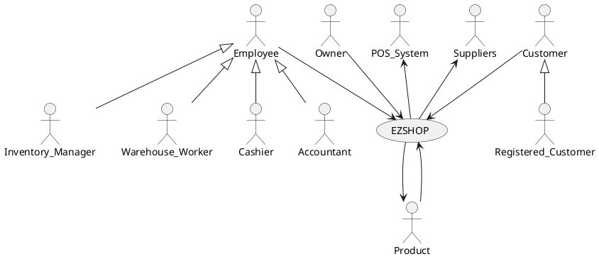

# Requirements Document 

Authors:

Date:

Version:

# Contents

- [Essential description](#essential-description)
- [Stakeholders](#stakeholders)
- [Context Diagram and interfaces](#context-diagram-and-interfaces)
	+ [Context Diagram](#context-diagram)
	+ [Interfaces](#interfaces) 
	
- [Stories and personas](#stories-and-personas)
- [Functional and non functional requirements](#functional-and-non-functional-requirements)
	+ [Functional Requirements](#functional-requirements)
	+ [Non functional requirements](#non-functional-requirements)
- [Use case diagram and use cases](#use-case-diagram-and-use-cases)
	+ [Use case diagram](#use-case-diagram)
	+ [Use cases](#use-cases)
    	+ [Relevant scenarios](#relevant-scenarios)
- [Glossary](#glossary)
- [System design](#system-design)
- [Deployment diagram](#deployment-diagram)

# Essential description

Small shops require a simple application to support the owner or manager. A small shop (ex a food shop) occupies 50-200 square meters, sells 500-2000 different item types, has one or a few cash registers 
EZShop is a software application to:
* manage sales
* manage inventory
* manage customers
* support accounting

# Stakeholders

| Stakeholder name  | Description | 
| ----------------- |:-----------:|
|	Customer  |	Use the application to find information about Products and Prizes, make purchases  |
|	Registered Customer  |	Use the application to find information about Products and Prizes, can login making purchases online and accumulate and spend points  |
|	Shop's Owner  | Pays for the application and owns the shop to which the application is made for  |
|	Supplier  | Supplies some kind of Inventory Items to the Shop |
|	POS System  | System through which the payment of products is done both in presence and online |
|	Inventory Item  | It may be a product in sale, a product in the Prize Catalog (that is exchanged for points), or a Work Tool  |
|	Cashier |  Employee that handle transactions at the cash register  |
|	Accountant  |  Employee that |
|	Warehouse Worker  |	Employee that move physically inventory item to and from the Warehouse |
|	Inventory Manager  |  Employee that manages inventory items from a logical point of view  |
|	Fidelity Card  |  Mechanism through which a Registered Customer is identified |

# Context Diagram and interfaces

## Context Diagram
\<Define here Context diagram using UML use case diagram>

\<actors are a subset of stakeholders>

## Interfaces
\<describe here each interface in the context diagram>

\<GUIs will be described graphically in a separate document>

| Actor | Logical Interface | Physical Interface  |
| ------------- |:-------------:| -----:|
|   Customer/Registered Customer    | Web Gui |  |
|	Inventory Manager	| Web Gui |
|	Accountant(?)	| Web Gui |
|	Cashier  | Web Gui |
|	Owner(?) | 	Web Gui |

# Stories and personas
\<A Persona is a realistic impersonation of an actor. Define here a few personas and describe in plain text how a persona interacts with the system>

\<Persona is-an-instance-of actor>

\<stories will be formalized later as scenarios in use cases>

Paul is 38 and just opened a new flower shop, he has some experience in business but not many resources to hire many workers. He spends many hours managing the inventory and the finances of his small shop. He thinks that he could better spend his time interacting with clients and taking care of the flowers.

Martina is 30 and works in an office all day. She wants to do shopping before going home, in his favorite food shop, once a week. She is very practical with computers and smartphones but doesn't want to dedicate too much time ordering online. 

Calogero is 29, he has been a cashier in a supermarket for the last 5 years. Being a cashier he has to deal with customers who want to receive a prize in exchange for their fidelity card points. In order to do so, every time a client asks for a certain item he should call an inventory worker to get the list of available items and eventually update it.

Giorgio is 23, he likes to play video games, for this reason often he goes to his favorite videogames shop and buys a lot of things. He would appreciate being rewarded for all his purchases.

# Functional and non functional requirements

## Functional Requirements

\<In the form DO SOMETHING, or VERB NOUN, describe high level capabilities of the system>

\<they match to high level use cases>

| ID        | Description  |
| ------------- |:-------------:| 
|  FR1    | Manage Registered Customer |
|  FR1.1  | Define a new customer or modify an existing one |
|  FR1.2  | Delete a Customer account  |
|  FR1.3  | List all Customers |
|  FR1.4  | Manage Fidelity Cards |
|  FR1.4.1  | Create Fidelity Card associated to the new Customer |
|  FR1.4.2  | Delete Fidelity Card |
|  FR1.4.3  | Update points on Card |
|  FR1.4.4  | Transfer points beetween Cards |
|  FR2  | Manage rights. Authorize access to functions to specific actors according to access rights |
|  FR3  | Manage Inventory |
|  FR3.1  | Define a new Inventory Item, or modify existing one |
|  FR3.2  | Remove Inventory Item |
|  FR3.3  | Update quantity of Inventory Items |
|  FR3.4  | List all Products |
|  FR3.5  | List all Prizes |
|  FR3.6  | List all Work tools |
|  FR3.7  | List all items with low quantity |
|  FR4 | Manage Accounting |
|  FR4.1 | Record each transaction |
|  FR4.2 | Record expenses for taxes and supplies |
|  FR4.3 | Show the total income per Day/Week/Month/Year |
|  FR4.4 | Show the total expenses per Week/Month/Year  |
|  FR5 | Manage Suppliers |
|  FR5.1 | Add new Supplier to Suppliers list |
|  FR5.2 | Delete Supplier from Suppliers list |
|  FR5.3 | List all Suppliers |
|  FR5.4 | List Suppliers of Products |
|  FR5.5 | List Suppliers of Work tools |
|  FR6   | Manage Replenishment |
|  FR6.1 | Add to Replenishment list Items which quantity is below a given threshold |
|  FR6.2 | Create an order at the end of the week based on Replenishment list and Suppliers list |
|  FR6.3 | Reset Replenishment list after order is done |
|  FR6.4 | Manage Order(?) |
|  FR6.4.1 | Add another product |
|  FR6.4.2 | Modify quantity |
|  FR6.4.3 | Modify Supplier where the product should be taken from |
|  FR6.4.4 | Delete product |
|  FR6.4.5 | Validate the order before sending it | 
|  FR7  | Manage Online Shooping |
|  FR7.1 | List all Products |
|  FR7.2 | Show Fidelity Card points |
|  FR7.3 | Show Personal Offers |
|  FR7.4 | Show History of transactions |
|  FR7.5 | Add Product to Cart |
|  FR7.6 | Remove Product to Cart |
|  FR7.7 | Show Products in Cart |
|  FR7.8 | Create an Order or modify Order |
|  FR7.8.1 | Choose day of withdrawal |
|  FR7.9 | Delete an Order |
|  FR8   | Manage Employee Account |
|  FR8.1 | Define a new Employee or modify existing one |
|  FR8.2 | Delete Employee |
|  FR8.3 | List Employees |
|  FR8.4 | Search for and Employee |

## Non Functional Requirements

\<Describe constraints on functional requirements>

| ID        | Type (efficiency, reliability, ..)           | Description  | Refers to |
| ------------- |:-------------:| :-----:| -----:|
|  NFR1     |  Usability | Application should be used with no specific training for Cashiers and Customers | |
|  NFR2     | |  | |
|  NFR3     | | | |
| NFRx .. | | | | 

# Use case diagram and use cases

## Use case diagram
\<define here UML Use case diagram UCD summarizing all use cases, and their relationships>

\<next describe here each use case in the UCD>
### Use case 1, UC1
| Actors Involved        |  |
| ------------- |:-------------:| 
|  Precondition     | \<Boolean expression, must evaluate to true before the UC can start> |  
|  Post condition     | \<Boolean expression, must evaluate to true after UC is finished> |
|  Nominal Scenario     | \<Textual description of actions executed by the UC> |
|  Variants     | \<other executions, ex in case of errors> |

##### Scenario 1.1 

\<describe here scenarios instances of UC1>

\<a scenario is a sequence of steps that corresponds to a particular execution of one use case>

\<a scenario is a more formal description of a story>

\<only relevant scenarios should be described>

| Scenario 1.1 | |
| ------------- |:-------------:| 
|  Precondition     | \<Boolean expression, must evaluate to true before the scenario can start> |
|  Post condition     | \<Boolean expression, must evaluate to true after scenario is finished> |
| Step#        | Description  |
|  1     |  |  
|  2     |  |
|  ...     |  |

##### Scenario 1.2

##### Scenario 1.x

### Use case 2, UC2
..

### Use case x, UCx
..

# Glossary

\<use UML class diagram to define important terms, or concepts in the domain of the system, and their relationships> 

\<concepts are used consistently all over the document, ex in use cases, requirements etc>

# System Design
\<describe here system design>

\<must be consistent with Context diagram>

# Deployment Diagram 

\<describe here deployment diagram >

