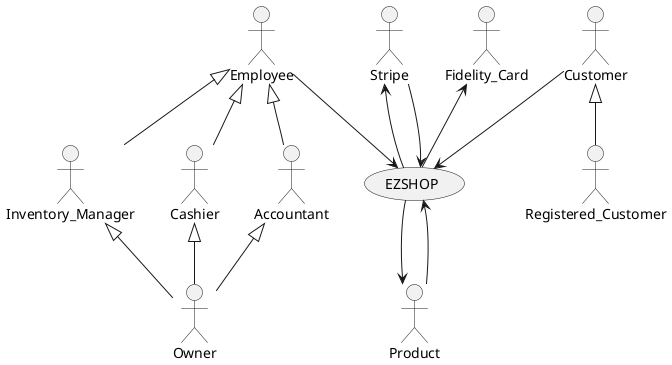
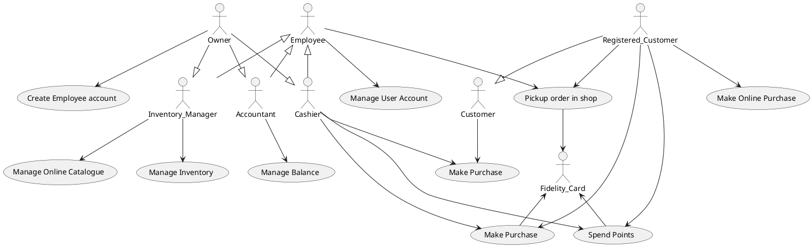
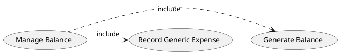
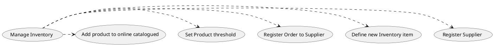
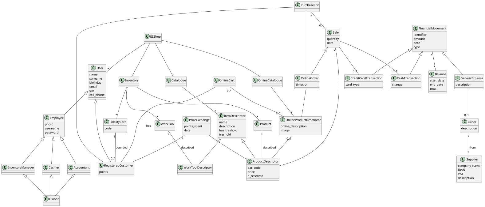
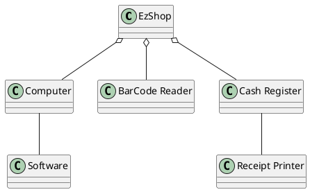
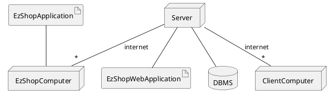

# Requirements Document 

Authors:

Date:

Version:

# Contents

- [Essential description](#essential-description)
- [Stakeholders](#stakeholders)
- [Context Diagram and interfaces](#context-diagram-and-interfaces)
	+ [Context Diagram](#context-diagram)
	+ [Interfaces](#interfaces) 
	
- [Stories and personas](#stories-and-personas)
- [Functional and non functional requirements](#functional-and-non-functional-requirements)
	+ [Functional Requirements](#functional-requirements)
	+ [Non functional requirements](#non-functional-requirements)
- [Use case diagram and use cases](#use-case-diagram-and-use-cases)
	+ [Use case diagram](#use-case-diagram)
	+ [Use cases](#use-cases)
    	+ [Relevant scenarios](#relevant-scenarios)
- [Glossary](#glossary)
- [System design](#system-design)
- [Deployment diagram](#deployment-diagram)

# Essential description

Small shops require a simple application to support the owner or manager. A small shop (ex a food shop) occupies 50-200 square meters, sells 500-2000 different item types, has one or a few cash registers 
EZShop is a software application to:
* manage sales
* manage inventory
* manage customers
* support accounting

The ezShop application  will offer  :
 * a management system of a simple inventory that is automatically updated after sales and orders
 * transaction handling with a fast and easy to use cash register interface that is able to register products with a simple bar code scanner
 * accounting support with a simple system that centralizes all types of expenses of common shops
 * an integrated fidelity system that enables recurrent customers to earn points
 * a simple online catalogue that is synchronized with the inventory and enables registered customers to send orders to pick up in store
# Stakeholders

| Stakeholder name  | Description | 
| ----------------- |:-----------:|
|	Customer  |	Use the application to find information about Products and Prizes, makes purchases  |
|	Registered Customer  |	Use the application to find information about Products and Prizes, can login making purchases online and accumulate and spend points  |
|	Owner  | Owns the shop, pays for the application and manages the employees. He can fill any role in the shop |
|	Supplier  | Supplies some kind of Inventory Items to the Shop |
|	Stripe  | Provides the payment gateway for online shopping and the POS System for the shopping inside the physical shop |
|	Inventory Item  | It may be a product on sale, or a Work Tool  |
|	Cashier |  Employee that handles transactions at the cash register, can register or delete customer accounts  |
|	Accountant  |  Employee that handles accounting |
|	Inventory Manager  |  Employee that manages inventory items from a logical point of view  |
|	Fidelity Card  |  Mechanism through which a Registered Customer is identified |

# Context Diagram and interfaces

## Context Diagram

## Interfaces

| Actor | Logical Interface | Physical Interface  |
| ------------- |:-------------:| -----:|
|   Customer/Registered Customer    | Web Gui | Screen, keyboard, mouse, touchscreen |
|	Employee	| Gui | Screen Keyboard Mouse |
|	Product	| Bar Code | Bar Code Scanner |
|	Fidelity Card  | Card Code | Card Code Scanner |
|	POS System | Web Services | Internet Connection |
|	Cashier	 | Gui | Screen Keyboard touchscreen |

# Stories and personas

Paul is 38 and just opened a new flower shop, he has some experience in business but not many resources to hire many workers. He spends many hours managing the inventory and the finances of his small shop. He thinks that he could better spend his time interacting with customers and taking care of the flowers.

Martina is 30 and works in an office all day. She wants to do shopping before going home, in his favorite food shop, once a week. She is very practical with computers and smartphones but doesn't want to dedicate too much time ordering online. 

Calogero is 18, he is a new cashier in a supermarket. It is his firt time to this job and he has to learn how to operate a cash register. Since it is his first time he makes many errors and he has to do lots of corrections.

Giorgio is 23, is an university student in computer engineering, he likes to play video games, for this reason often he goes to his favorite videogames shop and buys a lot of things. He would appreciate being rewarded for all his purchases.

Sofia is 59 and is an inventory manager in a small shop. Most of her time is used in registering all the sales made in a day and updating the inventory. Some times she makes mistakes and correcting them can be very difficult and timeconsuming.

# Functional and non functional requirements

## Functional Requirements

| ID        | Description  |
| ------------- |:-------------:| 
|  FR1    | Manage Registered Customer |
|  FR1.1  | Define a new customer or modify an existing one |
|  FR1.2  | Delete a Customer account  |
|  FR1.3  | List all Customers |
|  FR1.4  | Manage Fidelity Cards |
|  FR1.4.1  | Bound Fidelity_Card to a new Customer |
|  FR1.4.2  | Unbound Fidelity Card from customer |
|  FR1.4.3  | Update points on Card |
|  FR1.4.4  | Transfer points beetween Cards |
|  FR2  | Manage rights. Authorize access to functions to specific actors according to access rights |
|  FR3  | Manage Inventory |
|  FR3.1  | Define a new Inventory Item, or modify existing one |
|  FR3.2  | Remove Inventory Item |
|  FR3.3  | Update quantity of Inventory Items |
|  FR3.4  | List all Products |
|  FR3.5  | List all Work tools |
|  FR3.6  | List all items with low quantity |
|  FR3.7  | Manage product threshold |
|  FR3.7.1  | Set Product threshold |
|  FR3.7.2  | Remove Product threshold |
|  FR4 | Manage Accounting |
|  FR4.1 | Record each transaction |
|  FR4.2 | Record general expenses |
|  FR4.3 | Show the total income per Day/Week/Month/Year |
|  FR4.4 | Show the total expenses per Week/Month/Year  |
|  FR4.5 | Generate Balance |
|  FR5   | Manage Suppliers |
|  FR5.1 | Add new Supplier to Suppliers list |
|  FR5.2 | Delete Supplier from Suppliers list |
|  FR5.3 | List all Suppliers |
|  FR6   | Manage Replenishment |
|  FR6.1 | Add to Replenishment list Item which quantity is below its threshold |
|  FR6.2 | Create an order notification at the end of the week based on Replenishment list |
|  FR6.3 | Remove Item from Replenishment list when quantity is above its threshold |
|  FR6.4 | Register Order |
|  FR6.5 | Modify Order Description |
|  FR6.6 | Remove Order |
|  FR7  | Manage Online Shopping |
|  FR7.1 | List all Products |
|  FR7.2 | Show Fidelity Card points |
|  FR7.3 | Show History of transactions |
|  FR7.4 | Show Products in Cart |
|  FR7.5 | Add Product to Cart |
|  FR7.6 | Remove Product from Cart |
|  FR7.7 | Manage Order |
|  FR7.7.1 | Choose day of pickup in store |
|  FR7.7.2 | Create Order from cart |
|  FR7.7.3 | Modify Order |
|  FR7.7.4 | Pay for Online order (using Stripe) |
|  FR7.7.5 | Delete an Order |
|  FR8   | Manage Employee Account |
|  FR8.1 | Define a new Employee or modify existing one |
|  FR8.2 | Delete Employee |
|  FR8.3 | List Employees |
|  FR9   | Manage In-store shopping |
|  FR9.1   | Manage transaction |
|  FR9.1.1   | Add product to transaction |
|  FR9.1.2   | Remove product from transaction |
|  FR9.1.3   | Show product list |
|  FR9.1.4   | Show total amount |
|  FR9.1.5   | Manage payment with cash |
|  FR9.1.6   | Manage payment with credit card (using Stripe) |
|  FR9.1.7   | Discard transaction |

### Access right, actor vs function

| Function | Owner | Accountant | Inventory_Manager | Cashier | Registered Customer | Customer |
| ------------- |:-------------|--|--|--|--|--|
| FR1 | yes | yes | yes | yes | no | no |
| FR2 | yes | no | no | no | no | no |
| FR3 | yes | no | yes | no | no | no |
| FR4 | yes | yes | no | no | no | no |
| FR5 | yes | no | yes | no | no | no |
| FR6 | yes | no | yes | no | no | no |
| FR7 | no | no | no | no | yes | no |
| FR7.1 | no | no | no | no | yes | yes |
| FR8 | yes | no | no | no | no | no |
| FR9 | yes | no | no | yes | no | no |

## Non Functional Requirements

| ID        | Type (efficiency, reliability, ..)           | Description  | Refers to |
| ------------- |:-------------:| :-----:| -----:|
|  NFR1     | Usability | Web Application should be intuituive and easy to use | FR7 |
|  NFR2     | Usability | After one week employees should be able to do less then 2 errors a day | all FR |
|  NFR3     | Privacy | Employees should be able to access only functionalities related to their role | all FR |
|  NFR4     | Reliability | Webpages should have  at least 90% dailiy uptime | FR7 |
|  NFR5     | Portability | The Webpages should be accessed by Chrome (version 81 and more recent), and Safari (version 13 and more recent) (this covers around 80% of installed browsers)| FR7 |
|  NFR6     | Performance | Functions that are not transactions should complete in < 1.5 sec | all FR |
|  NFR7     | Localisation | Decimal numbers use . (dot) as decimal separator |All FR|
|  NFR8     | Privacy | Customer's personal information should not be disclosed | FR1 |
|  NFR9     | Security | Transaction data should be sent on a secure channel| FR9 and FR7 |
|  NFR10    | Performance | Web page should load in less than 1sec considering a client connection >= 7Mb/s | FR7 |
|  NFR11    | Privacy | Employee's personal information should not be disclosed | FR8 |

# Use case diagram and use cases

## Use case diagram

### Use case 1, UC1 - Create Customer Account
| Actors Involved |  Employee    |
| ------------- |:-------------:| 
|  Precondition     | Customer Account C does not Exist |
|  Precondition		| Fidelity card code F not already associated to an Account   |
|  Post condition     | Customer Account C added to the system  |
|  Post condition	  | Fidelity card F associated to A |	
|  Nominal Scenario     | A customer asks an employee to be enrolled in the fidelity program |
|  Variants     | Every customer can have at most 1 account and 1 fidelity card |

##### Scenario 1.1 
| Scenario 1.1 | Create Customer Account |
| ------------- |:-------------:| 
|  Precondition     | Customer Account C does not Exist |
|  Precondition		| Fidelity card code F not already associated to an Account   |
|  Post condition     | Customer Account C added to the system  |
|  Post condition	  | Fidelity card F associated to A |	
| Step#        | Description  |
|  1    | Employee logs in the system |  
|  2    | Employee inserts customer data |
|  3    | Employee inserts fidelity card code  |
|  4	| System checks if SSN Format is valid |
|  4.1  | If SSN is not valid goto Step #2 |
|  5	| System bounds Fidelity Card to SSN |	 

<!-- ### Use case 2, UC2 - Modify Customer Account 
| Actors Involved        | Employee |
| ------------- |:-------------:| 
|  Precondition     | Customer Account C exists |  
|  Post condition     | - |
|  Nominal Scenario     | Employee modifies Customer Account C |
 
### Use case 3, UC3 - Delete Customer Account
| Actors Involved        | Employee |
| ------------- |:-------------:| 
|  Precondition     | Customer Account C exists |  
|  Post condition     | Fidelity_Card F unbound from A |
|  Post condition     | Customer Account C removed from the system |
|  Nominal Scenario     | Employee deletes Customer Account C | -->

### Use case 2, UC2 - Create Employee Account
| Actors Involved        | Owner |
| ------------- |:-------------:| 
|  Precondition     | Employee Account E does not exists |  
|  Post condition     | Employee Account E added to the system |
|  Nominal Scenario     | Owner hires new employee |

##### Scenario 2.1 
| Scenario 2.1 | Create Employee Account |
| ------------- |:-------------:| 
|  Precondition     | Employee Account E does not Exist |
|  Post condition     | Employee Account E added to the system |
| Step#        | Description  |
|  1    | Owner logs in the system |  
|  2    | Owner inserts Employee data |
|  3    | System checks if SSN Format is valid |
|  3.1  | If SSN is not valid goto Step #2 |
|  4    | Owner sets Employee role |

<!-- ### Use case 5, UC5 - Modify Employee Account
| Actors Involved        | Owner |
| ------------- |:-------------:| 
|  Precondition     | Employee Account E exists |  
|  Post condition     | - |
|  Nominal Scenario     | Owner modifies employee account |

### Use case 6, UC6 - Delete Employee Account
| Actors Involved        | Owner |
| ------------- |:-------------:| 
|  Precondition     | Employee Account E exists |  
|  Post condition     | Account E removed from the system |
|  Nominal Scenario     | Owner removes Employee Account E | -->

### Use case 3, UC3 - Transfer points between user accounts
| Actors Involved      | Employee |
| ------------- |:-------------:| 
|  Precondition     | Customer Account C1 exists |
|  Precondition		| Customer Account C2 exists |
|  Precondition     | X <= C1's Fidelity Card Total Points |
|  Post condition     | An amount X of points are subtracted from C1's Fidelity Card|
|  Post condition     | An amount X of points are added to C2's Fidelity Card |
|  Nominal Scenario     | Employee transfers points beetween user accounts |

##### Scenario 3.1 
| Scenario 3.1 | Points are transferred between two cards |
| ------------- |:-------------:| 
|  Precondition     | Customer Account C1 exists |
|  Precondition		| Customer Account C2 exists |
|  Precondition     | X <= C1's Fidelity Card Total Points |
|  Post condition     | C1.points -= X |
|  Post condition     | C2.points += X |
| Step#        | Description  |
|  1    | Employee logs in |  
|  2    | Employee inserts C1's Fidelity Card |
|  3    | Employee inserts C2's Fidelity Card |
|  4	| Employee inserts amount X |
|  5	| Employee commits |

### Use case 4, UC4 - Record Generic Expense
| Actors Involved        | Accountant |
| ------------- |:-------------:| 
|  Precondition     | - |  
|  Post condition     | Expense EX registered in the system |
|  Nominal Scenario     | The accountant registers a generic expense |

##### Scenario 4.1 
| Scenario 4.1 | Record Generic Expense|
| ------------- |:-------------:| 
|  Precondition     | - |  
|  Post condition     | Expense EX registered in the system |
| Step#        | Description  |
|  1    | Accountant logs in |  
|  2    | Accountant inserts expense description |
|  3    | Accountant sets expense amount |

<!-- ### Use case 9, UC9 - Delete Generic Expense
| Actors Involved        | Accountant |
| ------------- |:-------------:| 
|  Precondition     | Expense EX exists |  
|  Post condition     | Expense EX removed from the system |
|  Nominal Scenario     | An Accountant removes an expense from the system | -->

### Use case 5, UC5 - Generate Balance
| Actors Involved        | Accountant |
| ------------- |:-------------:| 
|  Precondition     | At least one financial movement is recorded |  
|  Post condition     | Balance Exists |
|  Post condition	  | Balance can be exported with proper file extension |
|  Nominal Scenario     | Accountat A generates balance |

##### Scenario 5.1 
| Scenario 5.1 | Balance is generated for a specific time frame |
| ------------- |:-------------:| 
|  Precondition     | At least one financial movement is recorded | 
|  Post condition     | Balance Exists |
|  Post condition	  | Balance can be exported with proper file extension |
| Step#        | Description  |
|  1    | Accountant logs in |  
|  2    | Accountant selects timeframe |
|  3    | Accountant selects file extension |

<!-- ### Use case 11, UC11 - Show Financial movements
| Actors Involved        | Accountant |
| ------------- |:-------------:| 
|  Precondition     | Time range is valid |  
|  Post condition     | - |
|  Nominal Scenario     | Accountat selects a time range and the system shows all financial movements relative to that range |
|  Variants   | Filter only by expenses |
|  Variants   | Filter only by income | -->

### Use case 6, UC6 - Define new Inventory item
| Actors Involved        | Item, Inventory_Manager |
| ------------- |:-------------:| 
|  Precondition     | Item I doesn't exist |  
|  Post condition     | Item I added to inventory |
|  Nominal Scenario     | Inventory manager creates a new item and describes it, specifing the quantity |
|  Variants   | If the item is a Product, bar code and price are also registered |

##### Scenario 6.1 
| Scenario 6.1 | Item is a Work tool |
| ------------- |:-------------:| 
|  Precondition     | Item I doesn't exist |  
|  Post condition     | Item I added to inventory |
| Step#        | Description  |
|  1    | Inventory Manager logs in |  
|  2    | Inventory Manager inserts work tool datas |
|  3    | Inventory Manager sets work tool quantity |

##### Scenario 6.2 
| Scenario 12.2 | Item is a Product |
| ------------- |:-------------:| 
|  Precondition     | Item I doesn't exist |  
|  Post condition     | Item I added to inventory |
| Step#        | Description  |
|  1    | Inventory Manager logs in | 
|  2    | Inventory Manager inserts Product datas |
|  3    | Inventory Manager sets Product quantity |
|  4    | Inventory Manager inserts or scans Bar Code |  
|  5    | Inventory Manager sets Product's price |  

<!-- ### Use case 13, UC13 - Modify Inventory item
| Actors Involved        |  Inventory_Manager |
| ------------- |:-------------:| 
|  Precondition     | Item I exists |  
|  Post condition     | - |
|  Nominal Scenario     | Inventory manager modifies one or more fields of item I |

### Use case 14, UC14 - Remove Inventory item
| Actors Involved        |  Inventory_Manager |
| ------------- |:-------------:| 
|  Precondition     | Item I exists |  
|  Post condition     | Item I is removed from the system |
|  Nominal Scenario     | Inventory manager removes I from the system |

### Use case 15, UC15 - Update Quantity
| Actors Involved        |  Inventory_Manager |
| ------------- |:-------------:| 
|  Precondition     | Item I exists |  
|  Post condition     | - |
|  Nominal Scenario     | Inventory manager mofifies quantity of I | -->

### Use case 7, UC7 - Register Supplier 
| Actors Involved        |  Inventory_Manager |
| ------------- |:-------------:| 
|  Precondition     | Supplier S is not present in the system |  
|  Post condition     | Supplier S is added to Supplier list |
|  Nominal Scenario     | Inventory manager adds S to the Supplier list  |

##### Scenario 7.2 
| Scenario 7.2 | New Supplier S is added to the system |
| ------------- |:-------------:| 
|  Precondition     | Supplier S is not present in the system |  
|  Post condition     | Supplier S is added to Supplier list |
| Step#        | Description  |
|  1    | Inventory Manager logs in | 
|  2    | Inventory Manager inserts Supplier datas |
|  3    | Inventory Manager inserts Supplier's Banking data |
|  4    | Check validity of IBAN and VAT |  
|  4.1    | If IBAN or VAT is not valid goto #2 |  

<!-- ### Use case 17, UC17 - Modify Supplier 
| Actors Involved        |  Inventory_Manager |
| ------------- |:-------------:| 
|  Precondition     | Supplier S exists |  
|  Post condition     | - |
|  Nominal Scenario     | Inventory manager modifies one or more fields of supplier S  |

### Use case 18, UC18 - Delete Supplier 
| Actors Involved        |  Inventory_Manager |
| ------------- |:-------------:| 
|  Precondition     | Supplier S exists |  
|  Post condition     | Supplier S is removed from the system |
|  Nominal Scenario     | Inventory manager removes supplier S  | -->

### Use case 8, UC8 - Set Product threshold 
| Actors Involved        |  Inventory_Manager |
| ------------- |:-------------:| 
|  Precondition     | Item I exists |  
|  Post condition     | Item I threshold T is set|
|  Nominal Scenario     | Inventory Manager set the quantity under which a Product should be inserted in the supplies notification |

##### Scenario 8.2 
| Scenario 8.2 | Inventory Manager sets a product threshold |
| ------------- |:-------------:| 
|  Precondition     | Item I exists |  
|  Post condition     | Item I threshold T is set|
| Step#        | Description  |
|  1    | Inventory Manager logs in | 
|  2    | Inventory Manager selects product |
|  3    | Inventory Manager inserts threshold value | 

<!-- ### Use case 20, UC20 - Remove Product threshold 
| Actors Involved        |  Inventory_Manager |
| ------------- |:-------------:| 
|  Precondition     | threshold T of item I is set |  
|  Post condition     | Item I has no threshold|
|  Nominal Scenario     | The threshold for a specific Item I is removed | -->

### Use case 9 , UC9 - Add product to online catalogue
| Actors Involved        |  Inventory_Manager |
| ------------- |:-------------:| 
|  Precondition     | Product P exists in system |  
|  Post condition     | Product P is added to online Catalogue |
|  Nominal Scenario     | Inventory manager adds to the online Catalogue a specific product |

##### Scenario 9.2 
| Scenario 9.2 | Product is added to the online catalogue |
| ------------- |:-------------:| 
|  Precondition     | Product P exists in system |  
|  Post condition     | Product P is added to online Catalogue |
| Step#        | Description  |
|  1    | Inventory Manager logs in | 
|  2    | Inventory Manager selects a product |
|  3    | Inventory Manager inserts product description | 
|  4    | Inventory Manager inserts product image | 

<!-- ### Use case 22 , UC22 - Remove product from online catalogue
| Actors Involved        |  Inventory_Manager |
| ------------- |:-------------:| 
|  Precondition     | Product P is in the online Catalogue |  
|  Post condition     | Product P removed from the online Catalogue |
|  Nominal Scenario     | Inventory manager removes from the online Catalogue a specific product |

### Use case 23, UC23 - Modify product in online catalogue
| Actors Involved        |  Inventory_Manager |
| ------------- |:-------------:| 
|  Precondition     | Product P is in the online Catalogue |  
|  Post condition     | - |
|  Nominal Scenario     | Inventory manager modifies the fields of a specific product | -->

### Use case 10, UC 10 - Register order to supplier
| Actors Involved        |  Inventory_Manager |
| ------------- |:-------------:| 
|  Precondition     | Supplier S exists |  
|  Post condition     | Order O is registered |
|  Nominal Scenario     | Inventory_Manager registers Order O in the system |

##### Scenario 10.2 
| Scenario 10.2 | Order O is registered into the system |
| ------------- |:-------------:| 
|  Precondition     | Supplier S exists |  
|  Post condition     | Order O is registered |
| Step#        | Description  |
|  1    | Inventory Manager logs in | 
|  2    | Inventory Manager selects supplier|
|  3    | Inventory Manager inserts description | 
|  4    | Inventory Manager inserts total amount | 

### Use case 11, UC 11 - Customer makes purchase
| Actors Involved        |  Product, Customer, Cashier |
| ------------- |:-------------:| 
|  Precondition     | Customer has enough money to pay |  
|  Post condition     | Money are added to the cash register or to the Owner's Bank Account  |
|  Post condition      | Products are given to the Customer |
|  Nominal Scenario     | Customer purchases items with cash |
|  Variants      | Customer pays with credit card |
|  Variants      | Customer uses fidelity card in order to gain points |

##### Scenario 11.1
| Scenario 11.1 | Pays with cash No Fidelity Card |
| ------------- |:-------------:| 
|  Precondition     | Customer has enough money to pay |  
|  Post condition     | Money are added to the cash register |
|  Post condition      | Products are given to the Customer |
| Step#        | Description  |
|  1    | Cashier starts sale Transaction | 
|  2    | Cashier scans Products with Bar Code Scanner |
|  3    | Name and Price are retreived for Products |
|  4    | Repeat 2 and 3 for all Products |  
|  5    | Compute total T |
|  6	| Manage payment cash amount T |  
|  7	| Deduce quantity of products from system |  
|  8	| Print receipt |  
|  9	| Close Transaction |
|  10   | Register Transaction in the system |

##### Scenario 11.2
| Scenario 11.2 | Pays with credit card No Fidelity Card|
| ------------- |:-------------:| 
|  Precondition     | Customer has enough money to pay |  
|  Post condition     | Money are added to the Owner's Bank Account |
|  Post condition      | Products are given to the Customer |
| Step#        | Description  |
|  1    | Cashier starts sale Transaction | 
|  2    | Cashier scans Products with Bar Code Scanner |
|  3    | Name and Price are retreived for Products |
|  4    | Repeat 2 and 3 for all Products |  
|  5    | Compute total T |
|  6	| Customer uses Stripe POS system to read card |  
|  7	| Customer inserts Pin inside Stripe POS System |  
|  8	| System receives Payment confirmation |
|  9	| Deduce quantity of products from system |  
|  10	| Print receipt |  
|  11	| Close Transaction |
|  12   | Register Transaction in the system |

##### Scenario 11.3
| Scenario 11.3 | Pays with Cash, with Fidelity Card |
| ------------- |:-------------:| 
|  Precondition     | Registered Customer R has enough money to pay |
|  Precondition     | Registered Customer R submits Fidelity Card F to the Cashier |
|  Post condition   | Money are added to the cash register |
|  Post condition   | Products are given to the Customer |
|  Post condition   | Points P are added to F |
| Step#        | Description  |
|  1    | Cashier starts sale Transaction | 
|  2    | Cashier scans Products with Bar Code Scanner |
|  3    | Name and Price are retreived for Products |
|  4    | Repeat 2 and 3 for all Products |  
|  5    | Compute total T |
|  6    | Compute gained points P |
|  7	| Manage payment cash amount T |  
|  8	| Deduce quantity of products from system |  
|  9	| Print receipt |  
|  10	| Close Transaction |
|  11   | Register Transaction in the system |

##### Scenario 11.4
| Scenario 11.4 | Pays with credit card, with Fidelity Card |
| ------------- |:-------------:| 
|  Precondition     | Registered Customer R has enough money to pay |
|  Precondition     | Registered Customer R submits Fidelity Card F to the Cashier |
|  Post condition     | Money are added to the Owner's Bank Account |
|  Post condition      | Products are given to the Customer |
|  Post condition   | Points P are added to F |
| Step#        | Description  |
|  1    | Cashier starts sale Transaction | 
|  2    | Cashier scans Products with Bar Code Scanner |
|  3    | Name and Price are retreived for Products |
|  4    | Repeat 2 and 3 for all Products |  
|  5    | Compute total T |
|  6    | Compute gained points P |
|  7	| Customer uses Stripe POS system to read card |  
|  8	| Customer inserts Pin inside Stripe POS System |  
|  9	| System receives Payment confirmation |
|  10	| Deduce quantity of products from system |  
|  11	| Print receipt |  
|  12	| Close Transaction |
|  13   | Register Transaction in the system |
 
### Use case 12, UC 12 - Registered Customer makes online order
| Actors Involved        | Registered Customer |
| ------------- |:-------------:| 
|  Precondition     | Registered Customer account R exists |
|  Precondition     | Cart has at least one product |
|  Precondition     | Specified timeslot T is valid |
|  Post condition     | Money are added to the Owner's Bank Account  |
|  Nominal Scenario     | A Registered customer makes an order to be picked up in store |

##### Scenario 12.1
| Scenario 12.1 | Registered Customer makes online order |
| ------------- |:-------------:| 
|  Precondition     | Registered Customer account R exists |
|  Precondition     | Cart has at least one product |
|  Precondition     | Specified timeslot T is valid |
|  Post condition    | Money are added to the Owner's Bank Account  |
| Step#        | Description  |
|  1	| Total amount Tot is calculated |
|  2	| Registered Customer inserts payment methods into Stripe interface |
|  3	| Payment confirmation from Stripe is received  |
|  4	| Items in Cart are tagged as reserved |
|  5	| Pickup in store is reserved for timeslot T |
|  6	| Transaction Tr is registered in the system |

### Use case 13, UC 13 - Registered Customer pickups order in shop
| Actors Involved        |  Fidelity Card, Employee, Registered_Customer |
| ------------- |:-------------:| 
|  Precondition     | Registered Customer R has order to pickup |
|  Precondition 	| Fidelity Card is valid |
|  Post condition     | Products ordered are given to the Customer |
|  Nominal Scenario     | R book a pickup through the web app, then he goes to take his purchases after showing his Fidelity Card to an Employee |

##### Scenario 13.1
| Scenario 13.1 | Registered Customer pickups order in shop |
| ------------- |:-------------:| 
|  Precondition     | Registered Customer R has order to pickup |
|  Precondition 	| Fidelity Card code is valid |
|  Post condition     | Products ordered are given to the Customer |
| Step#        | Description  |
|  1	| Employee E logs in |
|  2	| Registered Customer R submits Fidelity Card F to Employee E |
|  3	| E checks in the system for pending order associated to F |
|  4	| E retrives reserved Products |
|  5	| E marks order as completed |
|  6	| Reseved Products are removed from the system |

### Use case 14, UC 14 - Registered Customer spends points
| Actors Involved      | Product, Cashier, Fidelity card, Registered Customer |
| ------------- |:-------------:| 
|  Precondition     | Fidelity card Code is valid  |
|  Precondition     | Fidelity card has enough points |   
|  Post condition     | - |
|  Nominal Scenario     | Registered Customer spends points in store |

##### Scenario 14.1
| Scenario 14.1 | Registered Customer spends points |
| ------------- |:-------------:| 
|  Precondition     | Fidelity card Code is valid  |
|  Precondition     | Fidelity card has enough points |   
|  Post condition     | - |
| Step#        | Description |
|  1	| Registered Customer R submits Fidelity Card F to Employee E |
|  2	| Employee start a Transaction |
|  3	| Employee E sets amount of points X |
|  4	| Employee E inserts Prize description |
|  5	| Employee E inserts Registered Customer Fidelity Card code |
|  6    | Product quantity is updated |
|  7	| Close Transaction |
|  8    | Register Transaction in system |
|  9	| E gives prize to R |

# Glossary

# System Design

# Deployment Diagram 

